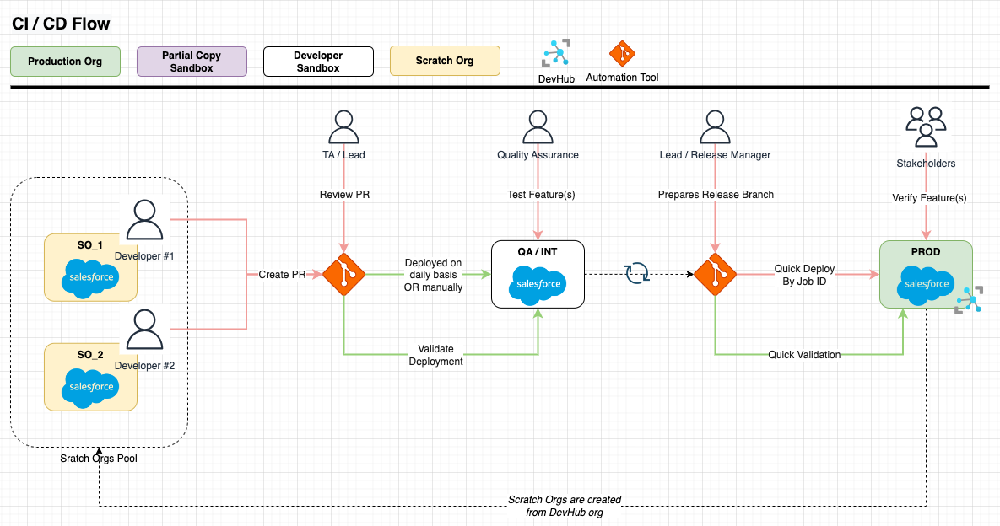
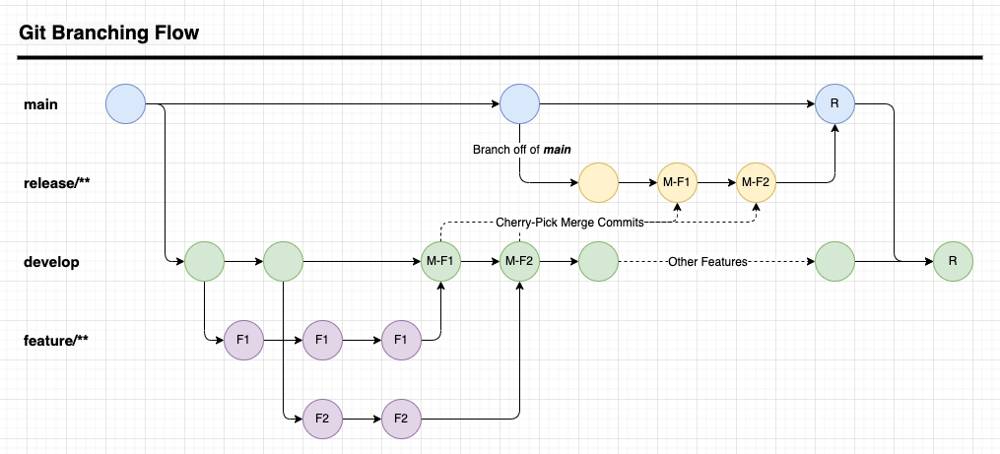

# minlopro-dx

<span>[](https://github.com/awesomeandrey/minlopro-dx/actions/workflows/create_scratch_org.yml)</span>
<span>[](https://github.com/awesomeandrey/minlopro-dx/actions/workflows/develop_workflow.yml)</span>
<span>[](https://github.com/awesomeandrey/minlopro-dx/actions/workflows/release_workflow.yml)</span>
<span>[](https://github.com/awesomeandrey/minlopro-dx/actions/workflows/reset_destructive_manifests.yml)</span>

## About

<span style="display: inline-flex; align-items: center;">
  
  This is a blueprint repository for a typical Salesforce org-based project which is accompanied with CI/CD automations.
</span>

## Prerequisites

Install `node` version specified in `package.json` file. It's recommended to
use [NVM](https://tecadmin.net/install-nvm-macos-with-homebrew/) in order to manage NODE versions on local machine.

Download and install [OpenJDK (11<)](https://sap.github.io/SapMachine/). This step is mandatory
for `prettier-plugin-apex` to work as expected. Refer to
this [link](https://medium.com/@bectorhimanshu/how-to-set-java-home-environment-variable-on-macos-x-10-9-or-later-versions-dd4fa6936899)
for configuring `$JAVA_HOME` environment variable.

Additionally install utility tools as follows: [`jq`](https://www.baeldung.com/linux/jq-command-json), [`xmllint`](https://www.baeldung.com/linux/xmllint), [`xmlstarlet`](https://xmlstar.sourceforge.net).

Run `bash ./scripts/deploy/build.sh` in order to load project dependencies.

Look through the pre-configured GitHub Workflows/Actions located in `.github/workflows/` folder.

Familiarise yourself with Salesforce environments involved and automations built around them:



Spin up scratch org by
running [Create Scratch Org](https://github.com/awesomeandrey/minlopro-dx/actions/workflows/create_scratch_org.yml)
GitHub Action Workflow.

Authorize scratch org using [`authorize_org.sh`](scripts/deploy/authorize_org.sh) command.

Make sure that the changed codebase files are _prettified_ via `npm run prettier:src:write` command.
Alternatively, you can run `npm run prettier:src:check` in order to identify _non-prettified_ files.

## Branches

_`main`_

Comprises all source code in the repository.

_`release/**`_

Short-living branch which comprises features to be deployed to Production org.
Descendant of _main_ branch.

_`develop`_

When the features are finished then they are merged into _develop_.
Descendant of _main_ branch.

For visual context, take a look at flowchart below:



### Release Branch Preparation

Lead developer is responsible for preparing release
branches. These branches, named `release/**`, serve as buffers for the upcoming release and are created from the `main`
branch.

Follow the steps below:

1. Create `release/**` branch off of `main`.
2. Collect merged pull requests from `develop` branch and cherry-pick them into `release/**` branch.
   For each merge commit, you can utilize `git cherry-pick -m 1 $COMMIT_SHA` command.
3. Automated workflow would run quick validation against `release/**` branch.
4. Introduce bugfixes (if applicable).
5. Once the `release/**` branch is ready & validated,
   invoke [Release](https://github.com/awesomeandrey/minlopro-dx/actions/workflows/release_workflow.yml) workflow
   manually. Make sure that **Do Quick Deploy?** checkbox is selected!
6. The last step is to merge `release/**` branch into `main` and `develop` branches.

This process ensures a structured flow of features into releases, maintaining stability and predictability in release
management.

## Useful Commands

_Deploy Codebase_

```
npm run sf:manifest:create && npm run src:deploy:full
```

_Publish Community_

```
sf community publish --name "DigEx" --target-org "$SCRATCH_ORG_ALIAS"
```

## Managing Environment Variables

Environment variables are useful for deploying metadata components with secrets or org-specific settings (e.g.
usernames, URLs, connected app credentials). This project benefits from GitHub Secrets & Environment Variables feature.
At the same time, there are project-level rules enforced with regards to using/replacing variables.

Follow steps below if there is a need to replace specific setting with variable value:

1. Define variable/secret in GitHub repository for the given GitHub Environment(s)
2. Incorporate environment variable into [`.env.manifest`](scripts/.env.manifest) file and provide description
3. Declare variable in affected workflow files (see `.github/workflows` folder)
4. Create replacement configuration in [`sfdx-project.json`](sfdx-project.json) file
5. Create reference(s) in metadata components (classes, named credentials etc.) using `@VAR_NAME` format

As an example, refer to `namedCredentials` or `customMetadata` folders.

## Scripts in `package.json`

Scripts that start with `sf:...` or `src:...` can be invoked with extra parameters passed to them.
E.g. you can execute particular script passing in ORG alias:

```
// Push source to target org
npm run src:push -- -o "$SCRATCH_ORG_ALIAS"
```

Please, refer
to [Salesforce CLI](https://developer.salesforce.com/docs/atlas.en-us.sfdx_cli_reference.meta/sfdx_cli_reference/cli_reference_unified.htm)
for more information.
