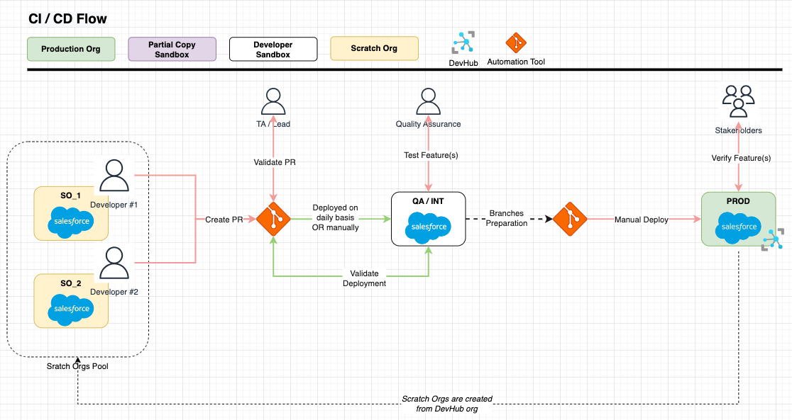

# minlopro-dx

<span>[](https://github.com/awesomeandrey/minlopro-dx/actions/workflows/deploy_workflow.yml)</span>
<span>[](https://github.com/awesomeandrey/minlopro-dx/actions/workflows/create_scratch_org.yml)</span>
<span>[](https://github.com/awesomeandrey/minlopro-dx/actions/workflows/reset_destructive_manifests.yml)</span>

## About

This is a blueprint repository for typical Salesforce org-based project which is accompanied with CI/CD automations.

## Prerequisites

Install `node` version specified in `package.json` file. It's recommended to
use [NVM](https://tecadmin.net/install-nvm-macos-with-homebrew/) in order to manage NODE versions on local machine.

Run `bash ./scripts/deploy/build.sh` in order to load project dependencies.

Look through the pre-configured GitHub Workflows/Actions located in `.github/workflows/` folder.

Familiarise yourself with Salesforce environments involved and automations built around them:



Spin up scratch org by
running [Create Scratch Org](https://github.com/awesomeandrey/minlopro-dx/actions/workflows/create_scratch_org.yml)
GitHub Action Workflow.

Make sure that the changed codebase files are _prettified_ via `npm run prettier` command.
Alternatively, you can run `npm run prettier:check` in order to identify _non-prettified_ files.

### Branches

_`main`_

Comprises all source code in the repository.

_`develop`_

Used for features development. Descendant of `main` branch. This branch should always be synced up with `main` branch
once the feature(s) has been developed, tested and pushed to release.

### Useful Commands

_Deploy Codebase_

```
npm run sf:manifest:create && npm run src:deploy:full
```

_Publish Community_

```
sf community publish --name "DigEx" --target-org $SCRATCH_ORG_ALIAS
```

### Managing Environment Variables

Environment variables are useful for deploying metadata components with secrets or org-specific settings (e.g.
usernames, URLs, connected app credentials). This project benefits from GitHub Secrets & Environment Variables feature.
At the same time, there are project-level rules enforced with regards to using/replacing variables.

Follow steps below if there is a need to replace specific setting with variable value:

1. Define an environment variable in GitHub repository
2. Import variable into workflow files affected (see `.github/workflows` folder)
3. Explicitly create reference(s) in metadata components using `@VAR_NAME` format

As an example, refer to `namedCredentials` or `customMetadata` folders.

### Scripts in `package.json`

Scripts that start with `sf:...` or `src:...` can be invoked with extra parameters passed to them.
E.g. you can execute particular script passing in ORG alias:

```
// Push source to target org
npm run src:push -- -o $SCRATCH_ORG_ALIAS
```

Please, refer
to [SF CLI](https://developer.salesforce.com/docs/atlas.en-us.sfdx_cli_reference.meta/sfdx_cli_reference/cli_reference_unified.htm)
for more information.
