# Minlopro - Auto-Assign PSG To DigEx Users

## Flow Diagram

```mermaid
%% If you read this, your Markdown visualizer does not handle MermaidJS syntax.
%% - If you are in VsCode, install extension `Markdown Preview Mermaid Support` at https://marketplace.visualstudio.com/items?itemName=bierner.markdown-mermaid
%% - If you are using sfdx-hardis, try to define env variable `MERMAID_MODES=cli,docker` ,then run again the command to regenerate markdown with SVG images.
%% - If you are within mkdocs-material, define mermaid plugin in `mkdocs.yml` as described in https://squidfunk.github.io/mkdocs-material/extensions/mermaid/
%% - At last resort, you can copy-paste this MermaidJS code in https://mermaid.live/ to see the Flow Diagram

flowchart TB
START(["START<br/><b>AutoLaunched Flow</b></br>Type: <b> Record After Save</b>"]):::startClass
click START "#general-information" "404534357"

Create_PSA_Prototype[\"🟰 <em></em><br/>Create PSA Prototype"/]:::assignments
click Create_PSA_Prototype "#create_psa_prototype" "2758014915"

Is_DigEx_Partner_Profile_User{"🔀 <em></em><br/>Is 'DigEx Partner' Profile User?"}:::decisions
click Is_DigEx_Partner_Profile_User "#is_digex_partner_profile_user" "386980963"

Insert_PSG_Assignment[("➕ <em></em><br/>Insert PSG Assignment")]:::recordCreates
click Insert_PSG_Assignment "#insert_psg_assignment" "4064492522"

Find_Minlopro_DigEx_PSG[("🔍 <em></em><br/>Find Minlopro DigEx PSG")]:::recordLookups
click Find_Minlopro_DigEx_PSG "#find_minlopro_digex_psg" "3436419395"

Create_PSA_Prototype --> Insert_PSG_Assignment
Is_DigEx_Partner_Profile_User --> |"DigEx Profile User"| Find_Minlopro_DigEx_PSG
Is_DigEx_Partner_Profile_User --> |"Default Outcome"| END_Is_DigEx_Partner_Profile_User
Insert_PSG_Assignment --> END_Insert_PSG_Assignment
Find_Minlopro_DigEx_PSG --> Create_PSA_Prototype
START -->  Is_DigEx_Partner_Profile_User
END_Is_DigEx_Partner_Profile_User(( END )):::endClass
END_Insert_PSG_Assignment(( END )):::endClass


classDef actionCalls fill:#D4E4FC,color:black,text-decoration:none,max-height:100px
classDef assignments fill:#FBEED7,color:black,text-decoration:none,max-height:100px
classDef collectionProcessors fill:#F0E3FA,color:black,text-decoration:none,max-height:100px
classDef customErrors fill:#FFE9E9,color:black,text-decoration:none,max-height:100px
classDef decisions fill:#FDEAF6,color:black,text-decoration:none,max-height:100px
classDef loops fill:#FDEAF6,color:black,text-decoration:none,max-height:100px
classDef recordCreates fill:#FFF8C9,color:black,text-decoration:none,max-height:100px
classDef recordDeletes fill:#FFF8C9,color:black,text-decoration:none,max-height:100px
classDef recordLookups fill:#EDEAFF,color:black,text-decoration:none,max-height:100px
classDef recordUpdates fill:#FFF8C9,color:black,text-decoration:none,max-height:100px
classDef screens fill:#DFF6FF,color:black,text-decoration:none,max-height:100px
classDef subflows fill:#D4E4FC,color:black,text-decoration:none,max-height:100px
classDef startClass fill:#D9F2E6,color:black,text-decoration:none,max-height:100px
classDef endClass fill:#F9BABA,color:black,text-decoration:none,max-height:100px


```

<!-- Flow description -->

## General Information

|<!-- -->|<!-- -->|
|:---|:---|
|Object|User|
|Process Type| Auto Launched Flow|
|Trigger Type| Record After Save|
|Record Trigger Type| Create|
|Label|Minlopro - Auto-Assign PSG To DigEx Users|
|Status|Obsolete|
|Environments|Default|
|Interview Label|Auto-Assign PSG To DigEx Users {!$Flow.CurrentDateTime}|
| Builder Type (PM)|LightningFlowBuilder|
| Canvas Mode (PM)|AUTO_LAYOUT_CANVAS|
| Origin Builder Type (PM)|LightningFlowBuilder|
|Connector|[Is_DigEx_Partner_Profile_User](#is_digex_partner_profile_user)|
|Next Node|[Is_DigEx_Partner_Profile_User](#is_digex_partner_profile_user)|

## Variables

|Name|Data Type|Is Collection|Is Input|Is Output|Object Type|Description|
|:-- |:--:|:--:|:--:|:--:|:--:|:--  |
|permissionSetAssignmentToInsert|SObject|⬜|⬜|⬜|PermissionSetAssignment|<!-- -->|

## Flow Nodes Details

### Create_PSA_Prototype

|<!-- -->|<!-- -->|
|:---|:---|
|Type|Assignment|
|Label|Create PSA Prototype|
|Connector|[Insert_PSG_Assignment](#insert_psg_assignment)|

#### Assignments

|Assign To Reference|Operator|Value|
|:-- |:--:|:--: |
|permissionSetAssignmentToInsert.AssigneeId| Assign|$Record.Id|
|permissionSetAssignmentToInsert.PermissionSetGroupId| Assign|Find_Minlopro_DigEx_PSG.Id|

### Is_DigEx_Partner_Profile_User

|<!-- -->|<!-- -->|
|:---|:---|
|Type|Decision|
|Label|Is 'DigEx Partner' Profile User?|
|Description|Check if the running user's profile is 'DigEx Partner'|
|Default Connector Label|Default Outcome|

#### Rule DigEx_Profile_User (DigEx Profile User)

|<!-- -->|<!-- -->|
|:---|:---|
|Connector|[Find_Minlopro_DigEx_PSG](#find_minlopro_digex_psg)|
|Condition Logic|and|

|Condition Id|Left Value Reference|Operator|Right Value|
|:-- |:-- |:--:|:--: |
|1|$Record.Profile.Name| Equal To|DigEx Partner|

### Insert_PSG_Assignment

|<!-- -->|<!-- -->|
|:---|:---|
|Type|Record Create|
|Label|Insert PSG Assignment|
|Input Reference|permissionSetAssignmentToInsert|

### Find_Minlopro_DigEx_PSG

|<!-- -->|<!-- -->|
|:---|:---|
|Type|Record Lookup|
|Object|PermissionSetGroup|
|Label|Find Minlopro DigEx PSG|
|Assign Null Values If No Records Found|⬜|
|Get First Record Only|✅|
|Store Output Automatically|✅|
|Connector|[Create_PSA_Prototype](#create_psa_prototype)|

#### Filters (logic: **and**)

|Filter Id|Field|Operator|Value|
|:-- |:-- |:--:|:--: |
|1|DeveloperName| Equal To|Minlopro_PSG_DigExUser|

___

_Documentation generated from branch feature/poc by [sfdx-hardis](https://sfdx-hardis.cloudity.com), featuring [salesforce-flow-visualiser](https://github.com/toddhalfpenny/salesforce-flow-visualiser)_