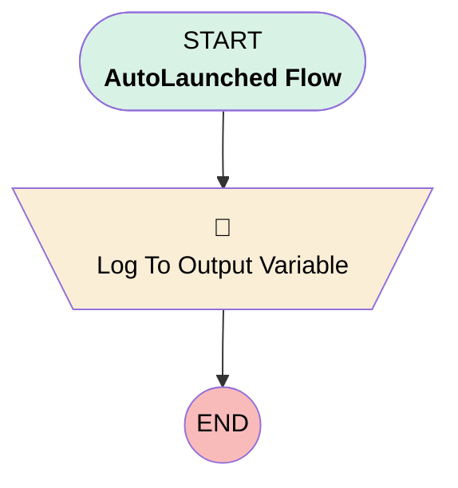

# Minlopro - Bot 🤖 - Log Variables

## Flow Diagram

<!-- Flow description -->

## General Information

|<!-- -->|<!-- -->|
|:---|:---|
|Process Type|Auto Launched Flow|
|Label|Minlopro - Bot 🤖 - Log Variables|
|Status|Active|
|Description|Sample flow invoked from Einstein Bot context.|
|Environments|Default|
|Interview Label|Minlopro_Bot_LogVariables {!$Flow.CurrentDateTime}|
|Run In Mode|Default Mode|
|BuilderType (PM)|LightningFlowBuilder|
|CanvasMode (PM)|AUTO_LAYOUT_CANVAS|
|OriginBuilderType (PM)|LightningFlowBuilder|
|Connector|[Log_To_Output_Variable](#log_to_output_variable)|
|Next Node|[Log_To_Output_Variable](#log_to_output_variable)|

## Variables

|Name|Data Type|Is Collection|Is Input|Is Output|Object Type|Description|
|:-- |:--:|:--:|:--:|:--:|:--:|:--  |
|botVariables|String|✅|⬜|⬜|<!-- -->|<!-- -->|
|context_ChannelType|String|⬜|✅|⬜|<!-- -->|<!-- -->|
|context_ContactId|String|⬜|✅|⬜|<!-- -->|<!-- -->|
|context_EchoMessage|String|⬜|✅|⬜|<!-- -->|<!-- -->|
|context_EndUserId|String|⬜|✅|⬜|<!-- -->|<!-- -->|
|outputText|String|⬜|⬜|✅|<!-- -->|<!-- -->|
|system_CurrentConversationLanguage|String|⬜|✅|⬜|<!-- -->|<!-- -->|
|system_LastCustomerInput|String|⬜|✅|⬜|<!-- -->|<!-- -->|

## Formulas

|Name|Data Type|Expression|Description|
|:-- |:--:|:-- |:--  |
|outputTextFormula|String|'(context_EchoMessage=' + {!context_EchoMessage} + '), ' + '(context_EndUserId=' + {!context_EndUserId} + '), ' + '(context_ChannelType=' + {!context_ChannelType} + '), ' + '(context_ContactId=' + {!context_ContactId} + '), ' + '(system_LastCustomerInput=' + {!system_LastCustomerInput} + '), ' + '(system_CurrentConversationLanguage=' + {!system_CurrentConversationLanguage} + ')'|<!-- -->|

## Flow Nodes Details

### Log_To_Output_Variable

|<!-- -->|<!-- -->|
|:---|:---|
|Type|Assignment|
|Label|Log To Output Variable|

#### Assignments

|Assign To Reference|Operator|Value|
|:-- |:--:|:--: |
|outputText|Assign|outputTextFormula|

___

_Documentation generated from branch develop by [sfdx-hardis](https://sfdx-hardis.cloudity.com), featuring [salesforce-flow-visualiser](https://github.com/toddhalfpenny/salesforce-flow-visualiser)_