# Minlopro - Bulk Process Accounts

## Flow Diagram

```mermaid
%% If you read this, your Markdown visualizer does not handle MermaidJS syntax.
%% - If you are in VsCode, install extension `Markdown Preview Mermaid Support` at https://marketplace.visualstudio.com/items?itemName=bierner.markdown-mermaid
%% - If you are using sfdx-hardis, try to define env variable `MERMAID_MODES=cli,docker` ,then run again the command to regenerate markdown with SVG images.
%% - If you are within mkdocs-material, define mermaid plugin in `mkdocs.yml` as described in https://squidfunk.github.io/mkdocs-material/extensions/mermaid/
%% - At last resort, you can copy-paste this MermaidJS code in https://mermaid.live/ to see the Flow Diagram

flowchart TB
START(["START<br/><b>Screen Flow</b>"]):::startClass
click START "#general-information" "2357971593"

Query_Accounts[("🔍 <em></em><br/>Query Accounts")]:::recordLookups
click Query_Accounts "#query_accounts" "3748561175"

Selected_Records_Confirmation(["💻 <em></em><br/>Selected Records Confirmation"]):::screens
click Selected_Records_Confirmation "#selected_records_confirmation" "1129526031"

Query_Accounts --> END_Query_Accounts
Selected_Records_Confirmation --> Query_Accounts
START -->  Selected_Records_Confirmation
END_Query_Accounts(( END )):::endClass


classDef actionCalls fill:#D4E4FC,color:black,text-decoration:none,max-height:100px
classDef assignments fill:#FBEED7,color:black,text-decoration:none,max-height:100px
classDef collectionProcessors fill:#F0E3FA,color:black,text-decoration:none,max-height:100px
classDef customErrors fill:#FFE9E9,color:black,text-decoration:none,max-height:100px
classDef decisions fill:#FDEAF6,color:black,text-decoration:none,max-height:100px
classDef loops fill:#FDEAF6,color:black,text-decoration:none,max-height:100px
classDef recordCreates fill:#FFF8C9,color:black,text-decoration:none,max-height:100px
classDef recordDeletes fill:#FFF8C9,color:black,text-decoration:none,max-height:100px
classDef recordLookups fill:#EDEAFF,color:black,text-decoration:none,max-height:100px
classDef recordUpdates fill:#FFF8C9,color:black,text-decoration:none,max-height:100px
classDef screens fill:#DFF6FF,color:black,text-decoration:none,max-height:100px
classDef subflows fill:#D4E4FC,color:black,text-decoration:none,max-height:100px
classDef startClass fill:#D9F2E6,color:black,text-decoration:none,max-height:100px
classDef endClass fill:#F9BABA,color:black,text-decoration:none,max-height:100px
classDef transforms fill:#FDEAF6,color:black,text-decoration:none,max-height:100px


```

<!-- Flow description -->

## General Information

|<!-- -->|<!-- -->|
|:---|:---|
|Process Type| Flow|
|Label|Minlopro - Bulk Process Accounts|
|Status|Active|
|Environments|Default|
|Interview Label|Minlopro - Bulk Process Accounts {!$Flow.CurrentDateTime}|
|Run In Mode| Default Mode|
| Builder Type (PM)|LightningFlowBuilder|
| Canvas Mode (PM)|AUTO_LAYOUT_CANVAS|
| Origin Builder Type (PM)|LightningFlowBuilder|
|Connector|[Selected_Records_Confirmation](#selected_records_confirmation)|
|Next Node|[Selected_Records_Confirmation](#selected_records_confirmation)|

## Variables

|Name|Data Type|Is Collection|Is Input|Is Output|Object Type|Description|
|:-- |:--:|:--:|:--:|:--:|:--:|:--  |
|ids|String|✅|✅|⬜|<!-- -->|Input record IDs selected from the list view|

## Flow Nodes Details

### Query_Accounts

|<!-- -->|<!-- -->|
|:---|:---|
|Type|Record Lookup|
|Object|Account|
|Label|Query Accounts|
|Description|Retrieve Accounts by IDs|
|Assign Null Values If No Records Found|⬜|
|Get First Record Only|⬜|
|Store Output Automatically|✅|

#### Filters (logic: **and**)

|Filter Id|Field|Operator|Value|
|:-- |:-- |:--:|:--: |
|1|Id| In|ids|

### Selected_Records_Confirmation

|<!-- -->|<!-- -->|
|:---|:---|
|Type|Screen|
|Label|Selected Records Confirmation|
|Description|Desc|
|Allow Back|⬜|
|Allow Finish|✅|
|Allow Pause|⬜|
|Show Footer|✅|
|Show Header|✅|
|Connector|[Query_Accounts](#query_accounts)|

#### IdsAsText

|<!-- -->|<!-- -->|
|:---|:---|
|Field Text|
Selected Record IDs: <strong>{!ids}</strong>
|
|Field Type| Display Text|

___

_Documentation generated from branch develop by [sfdx-hardis](https://sfdx-hardis.cloudity.com), featuring [salesforce-flow-visualiser](https://github.com/toddhalfpenny/salesforce-flow-visualiser)_