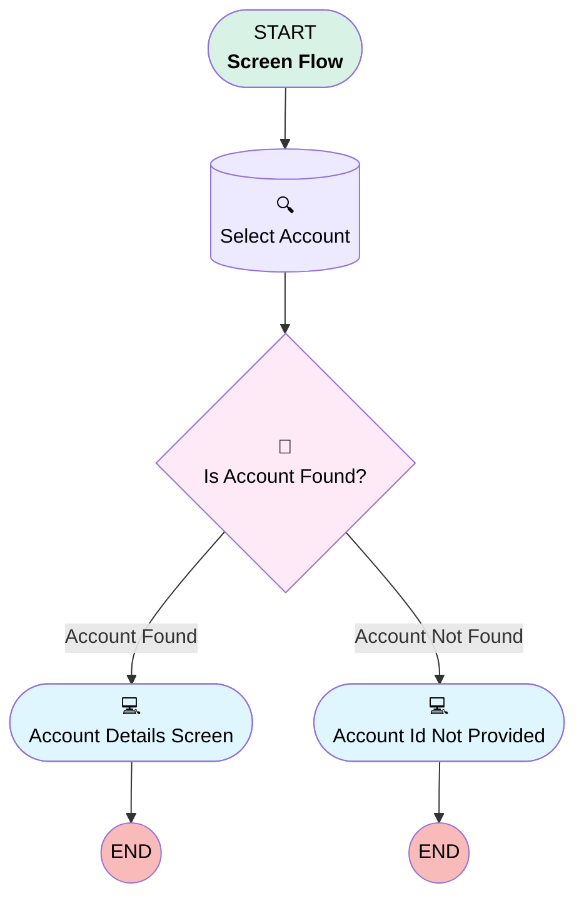

# Minlopro - CRMA - Preview Account Details

## Flow Diagram

<!-- Flow description -->

## General Information

|<!-- -->|<!-- -->|
|:---|:---|
|Process Type| Flow|
|Label|Minlopro - CRMA - Preview Account Details|
|Status|Active|
|Description|Sample Screen Flow embedded into CRM Analytics dashboard. The flow aims to show Account record details of the Opportunity selected in the dashboard.|
|Environments|Default|
|Interview Label|Minlopro - CRMA - Preview Account Details {!$Flow.CurrentDateTime}|
| Builder Type (PM)|LightningFlowBuilder|
| Canvas Mode (PM)|AUTO_LAYOUT_CANVAS|
| Origin Builder Type (PM)|LightningFlowBuilder|
|Connector|[Select_Account](#select_account)|
|Next Node|[Select_Account](#select_account)|

## Variables

|Name|Data Type|Is Collection|Is Input|Is Output|Object Type|Description|
|:-- |:--:|:--:|:--:|:--:|:--:|:--  |
|selectedAccountId|String|⬜|✅|⬜|<!-- -->|<!-- -->|

## Flow Nodes Details

### Is_Account_Found

|<!-- -->|<!-- -->|
|:---|:---|
|Type|Decision|
|Label|Is Account Found?|
|Default Connector|[Account_Id_Not_Provided](#account_id_not_provided)|
|Default Connector Label|Account Not Found|

#### Rule Account_Found (Account Found)

|<!-- -->|<!-- -->|
|:---|:---|
|Connector|[Account_Details_Screen](#account_details_screen)|
|Condition Logic|and|

|Condition Id|Left Value Reference|Operator|Right Value|
|:-- |:-- |:--:|:--: |
|1|Select_Account.Name| Is Null|⬜|

### Select_Account

|<!-- -->|<!-- -->|
|:---|:---|
|Type|Record Lookup|
|Object|Account|
|Label|Select Account|
|Assign Null Values If No Records Found|⬜|
|Get First Record Only|✅|
|Store Output Automatically|✅|
|Connector|[Is_Account_Found](#is_account_found)|

#### Filters (logic: **and**)

|Filter Id|Field|Operator|Value|
|:-- |:-- |:--:|:--: |
|1|Id| Equal To|selectedAccountId|

### Account_Details_Screen

|<!-- -->|<!-- -->|
|:---|:---|
|Type|Screen|
|Label|Account Details Screen|
|Allow Back|⬜|
|Allow Finish|✅|
|Allow Pause|⬜|
|Next Or Finish Button Label|Close|
|Show Footer|✅|
|Show Header|⬜|

#### AccountId

|<!-- -->|<!-- -->|
|:---|:---|
|Field Text|
Record ID: <strong>{!selectedAccountId}</strong>
|
|Field Type| Display Text|
|Style Properties|verticalAlignment: &nbsp;&nbsp;stringValue: top width: &nbsp;&nbsp;stringValue: 12 |
|Parent Field|[Account_Details_Screen_Section1_Column1](#account_details_screen_section1_column1)|

#### AccountName

|<!-- -->|<!-- -->|
|:---|:---|
|Field Text|
Name: <strong>{!Select_Account.Name}</strong>
|
|Field Type| Display Text|
|Style Properties|verticalAlignment: &nbsp;&nbsp;stringValue: top width: &nbsp;&nbsp;stringValue: 12 |
|Parent Field|[Account_Details_Screen_Section1_Column1](#account_details_screen_section1_column1)|

#### Account_Details_Screen_Section1_Column1

|<!-- -->|<!-- -->|
|:---|:---|
|Field Type| Region|
|Is Required|⬜|
|Parent Field|[Account_Details_Screen_Section1](#account_details_screen_section1)|
|Width (input)|6|

#### AccountIndustry

|<!-- -->|<!-- -->|
|:---|:---|
|Field Text|
Industry: <strong>{!Select_Account.Industry}</strong>
|
|Field Type| Display Text|
|Style Properties|verticalAlignment: &nbsp;&nbsp;stringValue: top width: &nbsp;&nbsp;stringValue: 12 |
|Parent Field|[Account_Details_Screen_Section1_Column2](#account_details_screen_section1_column2)|

#### Account_Details_Screen_Section1_Column2

|<!-- -->|<!-- -->|
|:---|:---|
|Field Type| Region|
|Is Required|⬜|
|Parent Field|[Account_Details_Screen_Section1](#account_details_screen_section1)|
|Width (input)|6|

#### Account_Details_Screen_Section1

|<!-- -->|<!-- -->|
|:---|:---|
|Field Type| Region Container|
|Is Required|⬜|
|Region Container Type| Section Without Header|
|Style Properties|verticalAlignment: &nbsp;&nbsp;stringValue: top width: &nbsp;&nbsp;stringValue: 12 |

### Account_Id_Not_Provided

|<!-- -->|<!-- -->|
|:---|:---|
|Type|Screen|
|Label|Account Id Not Provided|
|Allow Back|⬜|
|Allow Finish|✅|
|Allow Pause|⬜|
|Next Or Finish Button Label|Close|
|Show Footer|✅|
|Show Header|⬜|

#### AccountIdNotProvided

|<!-- -->|<!-- -->|
|:---|:---|
|Field Text|
<strong style="font-size: 14px; color: rgb(124, 22, 22);">Account ID was not provided!</strong>
|
|Field Type| Display Text|
|Style Properties|verticalAlignment: &nbsp;&nbsp;stringValue: top width: &nbsp;&nbsp;stringValue: 12 |

___

_Documentation generated from branch develop by [sfdx-hardis](https://sfdx-hardis.cloudity.com), featuring [salesforce-flow-visualiser](https://github.com/toddhalfpenny/salesforce-flow-visualiser)_