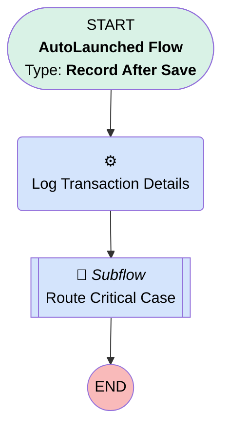

# Minlopro - Case - After Create

## Flow Diagram

<!-- Flow description -->

## General Information

|<!-- -->|<!-- -->|
|:---|:---|
|Object|Case|
|Process Type| Auto Launched Flow|
|Trigger Type| Record After Save|
|Record Trigger Type| Create|
|Label|Minlopro - Case - After Create|
|Status|Active|
|Description|Captures critical Case creation and routes to special queue!|
|Environments|Default|
|Interview Label|Minlopro_Case_AfterCreate {!$Flow.CurrentDateTime}|
| Builder Type (PM)|LightningFlowBuilder|
| Canvas Mode (PM)|AUTO_LAYOUT_CANVAS|
| Origin Builder Type (PM)|LightningFlowBuilder|
|Connector|[Log_Transaction_Details](#log_transaction_details)|
|Next Node|[Log_Transaction_Details](#log_transaction_details)|

## Formulas

|Name|Data Type|Expression|Description|
|:-- |:--:|:-- |:--  |
|hasCriticalSubject|Boolean|CONTAINS(LOWER({!$Record.Subject}),'critical')|<!-- -->|

## Flow Nodes Details

### Log_Transaction_Details

|<!-- -->|<!-- -->|
|:---|:---|
|Type|Action Call|
|Label|Log Transaction Details|
|Action Type|Apex|
|Action Name|FlowLogger|
|Flow Transaction Model|Automatic|
|Name Segment|FlowLogger|
|Offset|0|
|Message (input)|Entry Point 'Case' record-triggered flow|
|Connector|[Route_Critical_Case](#route_critical_case)|

### Route_Critical_Case

|<!-- -->|<!-- -->|
|:---|:---|
|Type|Subflow|
|Label|Route Critical Case|
|Flow Name|Minlopro_Omni_RouteCriticalCases|

#### Input Assignments

|Field|Value|
|:-- |:--: |
|<!-- -->|$Record.Id|

___

_Documentation generated from branch develop by [sfdx-hardis](https://sfdx-hardis.cloudity.com), featuring [salesforce-flow-visualiser](https://github.com/toddhalfpenny/salesforce-flow-visualiser)_