# Minlopro - Cast Contacts To Leads

## Flow Diagram

```mermaid
%% If you read this, your Markdown visualizer does not handle MermaidJS syntax.
%% - If you are in VsCode, install extension `Markdown Preview Mermaid Support` at https://marketplace.visualstudio.com/items?itemName=bierner.markdown-mermaid
%% - If you are using sfdx-hardis, try to define env variable `MERMAID_MODES=cli,docker` ,then run again the command to regenerate markdown with SVG images.
%% - If you are within mkdocs-material, define mermaid plugin in `mkdocs.yml` as described in https://squidfunk.github.io/mkdocs-material/extensions/mermaid/
%% - At last resort, you can copy-paste this MermaidJS code in https://mermaid.live/ to see the Flow Diagram

flowchart TB
START(["START<br/><b>Screen Flow</b>"]):::startClass
click START "#general-information" "3359535647"

Create_Lead_via_HTTP_POST("⚡ <em></em><br/>Create Lead via HTTP POST"):::actionCalls
click Create_Lead_via_HTTP_POST "#create_lead_via_http_post" "2528846551"

Calculate_Contacts_Count[\"🟰 <em></em><br/>Calculate Contacts Count"/]:::assignments
click Calculate_Contacts_Count "#calculate_contacts_count" "2289117099"

Update_Contact_Fields[\"🟰 <em></em><br/>Update Contact Fields"/]:::assignments
click Update_Contact_Fields "#update_contact_fields" "743088095"

Verify_Records_Selection_And_User_Permissions{"🔀 <em></em><br/>Verify Records Selection & User Permissions"}:::decisions
click Verify_Records_Selection_And_User_Permissions "#verify_records_selection_and_user_permissions" "1896047881"

Iterate_Through_Contacts{{"🔁 <em></em><br/>Iterate Through Contacts"}}:::loops
click Iterate_Through_Contacts "#iterate_through_contacts" "1561402739"

Select_Contacts[("🔍 <em></em><br/>Select Contacts")]:::recordLookups
click Select_Contacts "#select_contacts" "351118762"

Select_Failed_Contacts[("🔍 <em></em><br/>Select Failed Contacts")]:::recordLookups
click Select_Failed_Contacts "#select_failed_contacts" "733060385"

Update_Contact[("🛠️ <em></em><br/>Update Contact")]:::recordUpdates
click Update_Contact "#update_contact" "529318298"

Callout_Error_Screen(["💻 <em></em><br/>Callout Error Screen"]):::screens
click Callout_Error_Screen "#callout_error_screen" "1954134658"

FailedContactUpdateScreen(["💻 <em></em><br/>Failed Contact Update Screen"]):::screens
click FailedContactUpdateScreen "#failedcontactupdatescreen" "3140578750"

PreviewAndConfirmationScreen(["💻 <em></em><br/>Preview & Confirmation Screen"]):::screens
click PreviewAndConfirmationScreen "#previewandconfirmationscreen" "2473819884"

ResultssScreen(["💻 <em></em><br/>Results Screen"]):::screens
click ResultssScreen "#resultssscreen" "2794804771"

Warning_Screen(["💻 <em></em><br/>Warning Screen"]):::screens
click Warning_Screen "#warning_screen" "955833270"

Transform_Contact_To_Lead_Payload{{"♻️ <em></em><br/>Transform Contact To Lead Payload"}}:::transforms
click Transform_Contact_To_Lead_Payload "#transform_contact_to_lead_payload" "1315293370"

Create_Lead_via_HTTP_POST --> Update_Contact_Fields
Create_Lead_via_HTTP_POST -. Fault .->Callout_Error_Screen
Calculate_Contacts_Count --> Verify_Records_Selection_And_User_Permissions
Update_Contact_Fields --> Update_Contact
Verify_Records_Selection_And_User_Permissions --> |"Ineligible"| Warning_Screen
Verify_Records_Selection_And_User_Permissions --> |"Eligible"| PreviewAndConfirmationScreen
Iterate_Through_Contacts --> |"For Each"|Transform_Contact_To_Lead_Payload
Iterate_Through_Contacts ---> |"After Last"|Select_Failed_Contacts
Select_Contacts --> Calculate_Contacts_Count
Select_Failed_Contacts --> ResultssScreen
Update_Contact --> Iterate_Through_Contacts
Update_Contact -. Fault .->FailedContactUpdateScreen
Callout_Error_Screen --> Iterate_Through_Contacts
FailedContactUpdateScreen --> Iterate_Through_Contacts
PreviewAndConfirmationScreen --> Iterate_Through_Contacts
ResultssScreen --> END_ResultssScreen
Warning_Screen --> END_Warning_Screen
START -->  Select_Contacts
Transform_Contact_To_Lead_Payload --> Create_Lead_via_HTTP_POST
END_ResultssScreen(( END )):::endClass
END_Warning_Screen(( END )):::endClass


classDef actionCalls fill:#D4E4FC,color:black,text-decoration:none,max-height:100px
classDef assignments fill:#FBEED7,color:black,text-decoration:none,max-height:100px
classDef collectionProcessors fill:#F0E3FA,color:black,text-decoration:none,max-height:100px
classDef customErrors fill:#FFE9E9,color:black,text-decoration:none,max-height:100px
classDef decisions fill:#FDEAF6,color:black,text-decoration:none,max-height:100px
classDef loops fill:#FDEAF6,color:black,text-decoration:none,max-height:100px
classDef recordCreates fill:#FFF8C9,color:black,text-decoration:none,max-height:100px
classDef recordDeletes fill:#FFF8C9,color:black,text-decoration:none,max-height:100px
classDef recordLookups fill:#EDEAFF,color:black,text-decoration:none,max-height:100px
classDef recordUpdates fill:#FFF8C9,color:black,text-decoration:none,max-height:100px
classDef screens fill:#DFF6FF,color:black,text-decoration:none,max-height:100px
classDef subflows fill:#D4E4FC,color:black,text-decoration:none,max-height:100px
classDef startClass fill:#D9F2E6,color:black,text-decoration:none,max-height:100px
classDef endClass fill:#F9BABA,color:black,text-decoration:none,max-height:100px
classDef transforms fill:#FDEAF6,color:black,text-decoration:none,max-height:100px


```

<!-- Flow description -->

## General Information

|<!-- -->|<!-- -->|
|:---|:---|
|Process Type| Flow|
|Label|Minlopro - Cast Contacts To Leads|
|Status|Active|
|Description|Casts user-selected Contacts to Leads through Salesforce REST API.|
|Environments|Default|
|Interview Label|Minlopro - Send Contacts To Leads {!$Flow.CurrentDateTime}|
| Builder Type (PM)|LightningFlowBuilder|
| Canvas Mode (PM)|AUTO_LAYOUT_CANVAS|
| Origin Builder Type (PM)|LightningFlowBuilder|
|Connector|[Select_Contacts](#select_contacts)|
|Next Node|[Select_Contacts](#select_contacts)|

## Variables

|Name|Data Type|Is Collection|Is Input|Is Output|Object Type|Description|
|:-- |:--:|:--:|:--:|:--:|:--:|:--  |
|contactsSize|Number|⬜|⬜|⬜|<!-- -->|<!-- -->|
|httpPostResponseBody|String|⬜|⬜|⬜|<!-- -->|<!-- -->|
|httpPostResponseCode|Number|⬜|⬜|⬜|<!-- -->|<!-- -->|
|ids|String|✅|✅|⬜|<!-- -->|Contact IDs selected from the list view|

## Flow Nodes Details

### Create_Lead_via_HTTP_POST

|<!-- -->|<!-- -->|
|:---|:---|
|Type|Action Call|
|Label|Create Lead via HTTP POST|
|Action Type|External Service|
|Action Name|Minlopro.Create Lead|
|Description|Each HTTP callout is run in a separate transaction.|
|Fault Connector|[Callout_Error_Screen](#callout_error_screen)|
|Flow Transaction Model|NewTransaction|
|Name Segment|Minlopro.Create Lead|
|Offset|0|
|Output Parameters|- assignToReference: httpPostResponseCode &nbsp;&nbsp;name: responseCode - assignToReference: httpPostResponseBody &nbsp;&nbsp;name: defaultExc |
|Body (input)|[Transform_Contact_To_Lead_Payload](#transform_contact_to_lead_payload)|
|Connector|[Update_Contact_Fields](#update_contact_fields)|

### Calculate_Contacts_Count

|<!-- -->|<!-- -->|
|:---|:---|
|Type|Assignment|
|Label|Calculate Contacts Count|
|Connector|[Verify_Records_Selection_And_User_Permissions](#verify_records_selection_and_user_permissions)|

#### Assignments

|Assign To Reference|Operator|Value|
|:-- |:--:|:--: |
|contactsSize| Assign Count|[Select_Contacts](#select_contacts)|

### Update_Contact_Fields

|<!-- -->|<!-- -->|
|:---|:---|
|Type|Assignment|
|Label|Update Contact Fields|
|Description|Mark records as processed|
|Connector|[Update_Contact](#update_contact)|

#### Assignments

|Assign To Reference|Operator|Value|
|:-- |:--:|:--: |
|Iterate_Through_Contacts.IsCastToLead__c| Assign|✅|

### Verify_Records_Selection_And_User_Permissions

|<!-- -->|<!-- -->|
|:---|:---|
|Type|Decision|
|Label|Verify Records Selection & User Permissions|
|Default Connector|[PreviewAndConfirmationScreen](#previewandconfirmationscreen)|
|Default Connector Label|Eligible|

#### Rule Ineligible (Ineligible)

|<!-- -->|<!-- -->|
|:---|:---|
|Connector|[Warning_Screen](#warning_screen)|
|Condition Logic|or|

|Condition Id|Left Value Reference|Operator|Right Value|
|:-- |:-- |:--:|:--: |
|1|contactsSize| Equal To|numberValue: 0 |
|2|$Permission.IsLeadManager| Equal To|⬜|

### Iterate_Through_Contacts

|<!-- -->|<!-- -->|
|:---|:---|
|Type|Loop|
|Label|Iterate Through Contacts|
|Collection Reference|[Select_Contacts](#select_contacts)|
|Iteration Order|Asc|
|Next Value Connector|[Transform_Contact_To_Lead_Payload](#transform_contact_to_lead_payload)|
|No More Values Connector|[Select_Failed_Contacts](#select_failed_contacts)|

### Select_Contacts

|<!-- -->|<!-- -->|
|:---|:---|
|Type|Record Lookup|
|Object|Contact|
|Label|Select Contacts|
|Assign Null Values If No Records Found|⬜|
|Get First Record Only|⬜|
|Queried Fields|- Id - LastName - FirstName - Title - Phone - Email - LeadSource - MobilePhone - Name - IsCastToLead__c |
|Store Output Automatically|✅|
|Connector|[Calculate_Contacts_Count](#calculate_contacts_count)|

#### Filters (logic: **and**)

|Filter Id|Field|Operator|Value|
|:-- |:-- |:--:|:--: |
|1|Id| In|ids|
|2|IsCastToLead__c| Equal To|⬜|

### Select_Failed_Contacts

|<!-- -->|<!-- -->|
|:---|:---|
|Type|Record Lookup|
|Object|Contact|
|Label|Select Failed Contacts|
|Assign Null Values If No Records Found|⬜|
|Get First Record Only|⬜|
|Queried Fields|- Id - Title - FirstName - LastName - Phone - Email - LeadSource - Name - IsCastToLead__c |
|Store Output Automatically|✅|
|Connector|[ResultssScreen](#resultssscreen)|

#### Filters (logic: **and**)

|Filter Id|Field|Operator|Value|
|:-- |:-- |:--:|:--: |
|1|Id| In|ids|
|2|IsCastToLead__c| Equal To|⬜|

### Update_Contact

|<!-- -->|<!-- -->|
|:---|:---|
|Type|Record Update|
|Label|Update Contact|
|Fault Connector|[FailedContactUpdateScreen](#failedcontactupdatescreen)|
|Input Reference|[Iterate_Through_Contacts](#iterate_through_contacts)|
|Connector|[Iterate_Through_Contacts](#iterate_through_contacts)|

### Callout_Error_Screen

|<!-- -->|<!-- -->|
|:---|:---|
|Type|Screen|
|Label|Callout Error Screen|
|Allow Back|⬜|
|Allow Finish|✅|
|Allow Pause|⬜|
|Next Or Finish Button Label|Continue|
|Show Footer|✅|
|Show Header|✅|
|Stage Reference|Callout_Error|
|Connector|isGoTo: true targetReference: Iterate_Through_Contacts |

#### CalloutErrorText1

|<!-- -->|<!-- -->|
|:---|:---|
|Field Text|
Failed to cast Contact to Lead.

HTTP Response Status = <strong style="color: rgb(208, 50, 50); background-color: rgb(255, 255, 255);"><em>{!httpPostResponseCode} ({!$Flow.FaultMessage})</em></strong>
|
|Field Type| Display Text|

#### LeadPayloadText

|<!-- -->|<!-- -->|
|:---|:---|
|Field Text|
{!Transform_Contact_To_Lead_Payload}
|
|Field Type| Display Text|
|Parent Field|[Lead_Payload_Header_Column1](#lead_payload_header_column1)|

#### Lead_Payload_Header_Column1

|<!-- -->|<!-- -->|
|:---|:---|
|Field Type| Region|
|Is Required|⬜|
|Parent Field|[Lead_Payload_Header](#lead_payload_header)|
|Width (input)|12|

#### Lead_Payload_Header

|<!-- -->|<!-- -->|
|:---|:---|
|Field Text|Lead Payload|
|Field Type| Region Container|
|Is Required|⬜|
|Region Container Type| Section With Header|

### FailedContactUpdateScreen

|<!-- -->|<!-- -->|
|:---|:---|
|Type|Screen|
|Label|Failed Contact Update Screen|
|Allow Back|⬜|
|Allow Finish|✅|
|Allow Pause|⬜|
|Next Or Finish Button Label|Continue|
|Show Footer|✅|
|Show Header|✅|
|Connector|isGoTo: true targetReference: Iterate_Through_Contacts |

#### FailedContactUpdateText

|<!-- -->|<!-- -->|
|:---|:---|
|Field Text|
<strong>{!Iterate_Through_Contacts.Name}</strong> could not be marked as 'cast' due to 

<em style="color: rgb(166, 32, 32);">{!$Flow.FaultMessage}</em>
|
|Field Type| Display Text|

### PreviewAndConfirmationScreen

|<!-- -->|<!-- -->|
|:---|:---|
|Type|Screen|
|Label|Preview & Confirmation Screen|
|Allow Back|⬜|
|Allow Finish|✅|
|Allow Pause|⬜|
|Next Or Finish Button Label|Cast To Leads|
|Show Footer|✅|
|Show Header|✅|
|Stage Reference|Preview|
|Connector|[Iterate_Through_Contacts](#iterate_through_contacts)|

#### InfoText

|<!-- -->|<!-- -->|
|:---|:---|
|Field Text|
You're about to cast <strong style="font-size: 14px;">{!contactsSize}</strong> Contacts to Leads via Loopback Connected App leveraging Salesforce REST API.
|
|Field Type| Display Text|

#### ContactsDatatable

|<!-- -->|<!-- -->|
|:---|:---|
|Data Type Mappings|typeName: T typeValue: Contact |
|Extension Name|flowruntime:datatable|
|Field Type| Component Instance|
|Inputs On Next Nav To Assoc Scrn| Use Stored Values|
|Is Required|✅|
|Store Output Automatically|✅|
|Label (input)|Contacts to Cast|
|Selection Mode (input)|NO_SELECTION|
|Min Row Selection (input)|numberValue: 0 |
|Table Data (input)|[Select_Contacts](#select_contacts)|
|Should Display Label (input)|✅|
|Columns (input)|[{"apiName":"Name","guid":"column-a951","editable":false,"hasCustomHeaderLabel":false,"customHeaderLabel":"","wrapText":true,"order":0,"label":"Full Name","type":"text"},{"apiName":"Title","guid":"column-6a6e","editable":false,"hasCustomHeaderLabel":false,"customHeaderLabel":"","wrapText":true,"order":1,"label":"Title","type":"text"},{"apiName":"Email","guid":"column-9ba6","editable":false,"hasCustomHeaderLabel":false,"customHeaderLabel":"","wrapText":true,"order":2,"label":"Email","type":"email"},{"apiName":"MobilePhone","guid":"column-88e4","editable":false,"hasCustomHeaderLabel":false,"customHeaderLabel":"","wrapText":true,"order":3,"label":"Mobile Phone","type":"phone"},{"apiName":"IsCastToLead__c","guid":"column-34b8","editable":false,"hasCustomHeaderLabel":false,"customHeaderLabel":"","wrapText":true,"order":4,"label":"Cast To Lead?","type":"boolean"}]|
|Max Row Selection (input)|numberValue: 0 |

### ResultssScreen

|<!-- -->|<!-- -->|
|:---|:---|
|Type|Screen|
|Label|Results Screen|
|Allow Back|⬜|
|Allow Finish|✅|
|Allow Pause|⬜|
|Show Footer|✅|
|Show Header|✅|
|Stage Reference|Results|

#### ResultSuccessText

|<!-- -->|<!-- -->|
|:---|:---|
|Field Text|
<em style="font-size: 14px;">Yaahoo! All Contacts were cast to Leads via Salesforce REST API!</em>

<strong style="font-size: 14px; color: rgb(21, 182, 75);">Success</strong> ✅
|
|Field Type| Display Text|
|Visibility Rule|conditionLogic: and conditions: &nbsp;&nbsp;leftValueReference: $Flow.FaultMessage &nbsp;&nbsp;operator: IsNull &nbsp;&nbsp;rightValue: &nbsp;&nbsp;&nbsp;&nbsp;booleanValue: true |

#### ResultsText

|<!-- -->|<!-- -->|
|:---|:---|
|Field Text|
<em style="font-size: 14px;">Some Contact records failed to cast to Leads via Salesforce REST API. </em>

{!$Flow.FaultMessage}
|
|Field Type| Display Text|
|Visibility Rule|conditionLogic: and conditions: &nbsp;&nbsp;leftValueReference: $Flow.FaultMessage &nbsp;&nbsp;operator: NotEqualTo &nbsp;&nbsp;rightValue: &nbsp;&nbsp;&nbsp;&nbsp;stringValue: '' |

#### FailedContactsDatatable

|<!-- -->|<!-- -->|
|:---|:---|
|Data Type Mappings|typeName: T typeValue: Contact |
|Extension Name|flowruntime:datatable|
|Field Type| Component Instance|
|Inputs On Next Nav To Assoc Scrn| Use Stored Values|
|Is Required|✅|
|Store Output Automatically|✅|
|Visibility Rule|conditionLogic: and conditions: &nbsp;&nbsp;leftValueReference: $Flow.FaultMessage &nbsp;&nbsp;operator: NotEqualTo |
|Label (input)|Failed Contacts|
|Selection Mode (input)|NO_SELECTION|
|Min Row Selection (input)|numberValue: 0 |
|Should Display Label (input)|✅|
|Table Data (input)|[Select_Failed_Contacts](#select_failed_contacts)|
|Max Row Selection (input)|numberValue: 0 |
|Columns (input)|[{"apiName":"Name","guid":"column-62ab","editable":false,"hasCustomHeaderLabel":false,"customHeaderLabel":"","wrapText":true,"order":0,"label":"Full Name","type":"text"},{"apiName":"Title","guid":"column-3a8d","editable":false,"hasCustomHeaderLabel":false,"customHeaderLabel":"","wrapText":true,"order":1,"label":"Title","type":"text"},{"apiName":"Email","guid":"column-463b","editable":false,"hasCustomHeaderLabel":false,"customHeaderLabel":"","wrapText":true,"order":2,"label":"Email","type":"email"},{"apiName":"MobilePhone","guid":"column-ad1e","editable":false,"hasCustomHeaderLabel":false,"customHeaderLabel":"","wrapText":true,"order":3,"label":"Mobile Phone","type":"phone"},{"apiName":"IsCastToLead__c","guid":"column-8099","editable":false,"hasCustomHeaderLabel":false,"customHeaderLabel":"","wrapText":true,"order":4,"label":"Cast To Lead?","type":"boolean"}]|

### Warning_Screen

|<!-- -->|<!-- -->|
|:---|:---|
|Type|Screen|
|Label|Warning Screen|
|Allow Back|⬜|
|Allow Finish|✅|
|Allow Pause|⬜|
|Next Or Finish Button Label|Close|
|Show Footer|✅|
|Show Header|✅|

#### SuspendText

|<!-- -->|<!-- -->|
|:---|:---|
|Field Text|
<em style="font-size: 14px;">You can't proceed: either there are no eligible Contacts selected OR you don't have necessary access level. </em>
|
|Field Type| Display Text|

### Transform_Contact_To_Lead_Payload

|<!-- -->|<!-- -->|
|:---|:---|
|Type|Transform|
|Label|Transform Contact To Lead Payload|
|Data Type|Apex|
|Apex Class|ExternalService__Minlopro_Createx20Lead_IN_body|
|Is Collection|⬜|
|Scale|0|
|Store Output Automatically|✅|
|Connector|[Create_Lead_via_HTTP_POST](#create_lead_via_http_post)|

#### Transform actions

|Transform Type|Value|Output Field Api Name|
|:-- |:--:|:--  |
|Map|Iterate_Through_Contacts.Email|Email|
|Map|Iterate_Through_Contacts.FirstName|FirstName|
|Map|Iterate_Through_Contacts.LastName|LastName|
|Map|Iterate_Through_Contacts.Phone|Phone|
|Map|Iterate_Through_Contacts.Title|Title|
|Map|Contact2Lead|LeadSource|

___

_Documentation generated from branch develop by [sfdx-hardis](https://sfdx-hardis.cloudity.com), featuring [salesforce-flow-visualiser](https://github.com/toddhalfpenny/salesforce-flow-visualiser)_