# Minlopro - Cast Contacts To Leads (Bulk)

## Flow Diagram

```mermaid
%% If you read this, your Markdown visualizer does not handle MermaidJS syntax.
%% - If you are in VsCode, install extension `Markdown Preview Mermaid Support` at https://marketplace.visualstudio.com/items?itemName=bierner.markdown-mermaid
%% - If you are using sfdx-hardis, try to define env variable `MERMAID_MODES=cli,docker` ,then run again the command to regenerate markdown with SVG images.
%% - If you are within mkdocs-material, define mermaid plugin in `mkdocs.yml` as described in https://squidfunk.github.io/mkdocs-material/extensions/mermaid/
%% - At last resort, you can copy-paste this MermaidJS code in https://mermaid.live/ to see the Flow Diagram

flowchart TB
START(["START<br/><b>Screen Flow</b>"]):::startClass
click START "#general-information" "2220808193"

Create_Leads_via_HTTP_POST("⚡ <em></em><br/>Create Leads via HTTP POST"):::actionCalls
click Create_Leads_via_HTTP_POST "#create_leads_via_http_post" "187876858"

Calculate_Contacts_Count[\"🟰 <em></em><br/>Calculate Contacts Count"/]:::assignments
click Calculate_Contacts_Count "#calculate_contacts_count" "2289117099"

Verify_Records_Selection_And_User_Permissions{"🔀 <em></em><br/>Verify Records Selection & User Permissions"}:::decisions
click Verify_Records_Selection_And_User_Permissions "#verify_records_selection_and_user_permissions" "1003782354"

Select_Contacts[("🔍 <em></em><br/>Select Contacts")]:::recordLookups
click Select_Contacts "#select_contacts" "351118762"

Update_Contacts[("🛠️ <em></em><br/>Update Contacts")]:::recordUpdates
click Update_Contacts "#update_contacts" "1805384428"

Callout_Error_Screen(["💻 <em></em><br/>Callout Error Screen"]):::screens
click Callout_Error_Screen "#callout_error_screen" "2931229614"

Failed_Contact_Update_Screen(["💻 <em></em><br/>Failed Contact Update Screen"]):::screens
click Failed_Contact_Update_Screen "#failed_contact_update_screen" "1820395957"

PreviewAndConfirmationScreen(["💻 <em></em><br/>Preview & Confirmation Screen"]):::screens
click PreviewAndConfirmationScreen "#previewandconfirmationscreen" "2016774427"

Results_Screen(["💻 <em></em><br/>Results Screen"]):::screens
click Results_Screen "#results_screen" "478658817"

Suspend_Screen(["💻 <em></em><br/>Suspend Screen"]):::screens
click Suspend_Screen "#suspend_screen" "3604171125"

Search_Account[["🔗 <em>Subflow</em><br/>Search Account"]]:::subflows
click Search_Account "#search_account" "478877016"

Mark_Contacts_As_Processed{{"♻️ <em></em><br/>Mark Contacts As Processed"}}:::transforms
click Mark_Contacts_As_Processed "#mark_contacts_as_processed" "3827616622"

Transform_Contacts_To_Leads{{"♻️ <em></em><br/>Transform Contacts To Leads"}}:::transforms
click Transform_Contacts_To_Leads "#transform_contacts_to_leads" "2039688331"

Create_Leads_via_HTTP_POST --> Mark_Contacts_As_Processed
Create_Leads_via_HTTP_POST -. Fault .->Callout_Error_Screen
Calculate_Contacts_Count --> Verify_Records_Selection_And_User_Permissions
Verify_Records_Selection_And_User_Permissions --> |"Ineligible"| Suspend_Screen
Verify_Records_Selection_And_User_Permissions --> |"Eligible"| PreviewAndConfirmationScreen
Select_Contacts --> Calculate_Contacts_Count
Update_Contacts --> Results_Screen
Update_Contacts -. Fault .->Failed_Contact_Update_Screen
Callout_Error_Screen --> END_Callout_Error_Screen
Failed_Contact_Update_Screen --> END_Failed_Contact_Update_Screen
PreviewAndConfirmationScreen --> Search_Account
Results_Screen --> END_Results_Screen
Suspend_Screen --> END_Suspend_Screen
START -->  Select_Contacts
Search_Account --> Transform_Contacts_To_Leads
Mark_Contacts_As_Processed --> Update_Contacts
Transform_Contacts_To_Leads --> Create_Leads_via_HTTP_POST
END_Callout_Error_Screen(( END )):::endClass
END_Failed_Contact_Update_Screen(( END )):::endClass
END_Results_Screen(( END )):::endClass
END_Suspend_Screen(( END )):::endClass


classDef actionCalls fill:#D4E4FC,color:black,text-decoration:none,max-height:100px
classDef assignments fill:#FBEED7,color:black,text-decoration:none,max-height:100px
classDef collectionProcessors fill:#F0E3FA,color:black,text-decoration:none,max-height:100px
classDef customErrors fill:#FFE9E9,color:black,text-decoration:none,max-height:100px
classDef decisions fill:#FDEAF6,color:black,text-decoration:none,max-height:100px
classDef loops fill:#FDEAF6,color:black,text-decoration:none,max-height:100px
classDef recordCreates fill:#FFF8C9,color:black,text-decoration:none,max-height:100px
classDef recordDeletes fill:#FFF8C9,color:black,text-decoration:none,max-height:100px
classDef recordLookups fill:#EDEAFF,color:black,text-decoration:none,max-height:100px
classDef recordUpdates fill:#FFF8C9,color:black,text-decoration:none,max-height:100px
classDef screens fill:#DFF6FF,color:black,text-decoration:none,max-height:100px
classDef subflows fill:#D4E4FC,color:black,text-decoration:none,max-height:100px
classDef startClass fill:#D9F2E6,color:black,text-decoration:none,max-height:100px
classDef endClass fill:#F9BABA,color:black,text-decoration:none,max-height:100px
classDef transforms fill:#FDEAF6,color:black,text-decoration:none,max-height:100px


```

<!-- Flow description -->

## General Information

|<!-- -->|<!-- -->|
|:---|:---|
|Process Type| Flow|
|Label|Minlopro - Cast Contacts To Leads (Bulk)|
|Status|Active|
|Description|Casts Contacts to Leads through Salesforce Composite API. Only 1 HTTP callout is used to insert records in bulk.|
|Environments|Default|
|Interview Label|Minlopro - Cast Contacts To Leads (Bulk) {!$Flow.CurrentDateTime}|
|Run In Mode| System Mode Without Sharing|
| Builder Type (PM)|LightningFlowBuilder|
| Canvas Mode (PM)|AUTO_LAYOUT_CANVAS|
| Origin Builder Type (PM)|LightningFlowBuilder|
|Connector|[Select_Contacts](#select_contacts)|
|Next Node|[Select_Contacts](#select_contacts)|

## Variables

|Name|Data Type|Is Collection|Is Input|Is Output|Object Type|Description|
|:-- |:--:|:--:|:--:|:--:|:--:|:--  |
|contactsSize|Number|⬜|⬜|⬜|<!-- -->|<!-- -->|
|ids|String|✅|✅|⬜|<!-- -->|Contact IDs selected from the list view|
|selectedAccount|SObject|⬜|⬜|⬜|Account|<!-- -->|

## Flow Nodes Details

### Create_Leads_via_HTTP_POST

|<!-- -->|<!-- -->|
|:---|:---|
|Type|Action Call|
|Label|Create Leads via HTTP POST|
|Action Type|External Service|
|Action Name|MinloproCreateLeadsApiBulk.Create Leads|
|Fault Connector|[Callout_Error_Screen](#callout_error_screen)|
|Flow Transaction Model|NewTransaction|
|Name Segment|MinloproCreateLeadsApiBulk.Create Leads|
|Offset|0|
|Store Output Automatically|✅|
|Body (input)|[Transform_Contacts_To_Leads](#transform_contacts_to_leads)|
|Connector|[Mark_Contacts_As_Processed](#mark_contacts_as_processed)|

### Calculate_Contacts_Count

|<!-- -->|<!-- -->|
|:---|:---|
|Type|Assignment|
|Label|Calculate Contacts Count|
|Connector|[Verify_Records_Selection_And_User_Permissions](#verify_records_selection_and_user_permissions)|

#### Assignments

|Assign To Reference|Operator|Value|
|:-- |:--:|:--: |
|contactsSize| Assign Count|[Select_Contacts](#select_contacts)|

### Verify_Records_Selection_And_User_Permissions

|<!-- -->|<!-- -->|
|:---|:---|
|Type|Decision|
|Label|Verify Records Selection & User Permissions|
|Default Connector|[PreviewAndConfirmationScreen](#previewandconfirmationscreen)|
|Default Connector Label|Eligible|

#### Rule Ineligible (Ineligible)

|<!-- -->|<!-- -->|
|:---|:---|
|Connector|[Suspend_Screen](#suspend_screen)|
|Condition Logic|or|

|Condition Id|Left Value Reference|Operator|Right Value|
|:-- |:-- |:--:|:--: |
|1|contactsSize| Equal To|numberValue: 0 |
|2|$Permission.IsLeadManager| Equal To|⬜|

### Select_Contacts

|<!-- -->|<!-- -->|
|:---|:---|
|Type|Record Lookup|
|Object|Contact|
|Label|Select Contacts|
|Assign Null Values If No Records Found|⬜|
|Get First Record Only|⬜|
|Queried Fields|- Id - LastName - FirstName - Title - Phone - Email - LeadSource - MobilePhone - Name - IsCastToLead__c |
|Store Output Automatically|✅|
|Connector|[Calculate_Contacts_Count](#calculate_contacts_count)|

#### Filters (logic: **and**)

|Filter Id|Field|Operator|Value|
|:-- |:-- |:--:|:--: |
|1|Id| In|ids|
|2|IsCastToLead__c| Equal To|⬜|

### Update_Contacts

|<!-- -->|<!-- -->|
|:---|:---|
|Type|Record Update|
|Label|Update Contacts|
|Fault Connector|[Failed_Contact_Update_Screen](#failed_contact_update_screen)|
|Input Reference|[Mark_Contacts_As_Processed](#mark_contacts_as_processed)|
|Connector|[Results_Screen](#results_screen)|

### Callout_Error_Screen

|<!-- -->|<!-- -->|
|:---|:---|
|Type|Screen|
|Label|Callout Error Screen|
|Allow Back|⬜|
|Allow Finish|✅|
|Allow Pause|⬜|
|Next Or Finish Button Label|Done|
|Show Footer|✅|
|Show Header|✅|

#### CalloutErrorText

|<!-- -->|<!-- -->|
|:---|:---|
|Field Text|
The HTTP callout failed. The selected Contacts could not be cast to Leads.

 

HTTP Response Status: <strong style="color: rgb(173, 30, 30);">{!$Flow.FaultMessage}</strong>

 

HTTP payload below failed to send.
|
|Field Type| Display Text|

#### CalloutPayload

|<!-- -->|<!-- -->|
|:---|:---|
|Field Text|
{!Transform_Contacts_To_Leads.records}
|
|Field Type| Display Text|
|Parent Field|[HTTP_Request_Payload_Column1](#http_request_payload_column1)|

#### HTTP_Request_Payload_Column1

|<!-- -->|<!-- -->|
|:---|:---|
|Field Type| Region|
|Is Required|⬜|
|Parent Field|[HTTP_Request_Payload](#http_request_payload)|
|Width (input)|12|

#### HTTP_Request_Payload

|<!-- -->|<!-- -->|
|:---|:---|
|Field Text|HTTP Request Payload|
|Field Type| Region Container|
|Is Required|⬜|
|Region Container Type| Section With Header|

### Failed_Contact_Update_Screen

|<!-- -->|<!-- -->|
|:---|:---|
|Type|Screen|
|Label|Failed Contact Update Screen|
|Allow Back|⬜|
|Allow Finish|✅|
|Allow Pause|⬜|
|Next Or Finish Button Label|Continue|
|Show Footer|✅|
|Show Header|✅|

#### FailedContactUpdateText

|<!-- -->|<!-- -->|
|:---|:---|
|Field Text|
{!Mark_Contacts_As_Processed} could not be marked as 'cast' due to

<strong style="color: rgb(189, 37, 37);">{!$Flow.FaultMessage}</strong>
|
|Field Type| Display Text|

### PreviewAndConfirmationScreen

|<!-- -->|<!-- -->|
|:---|:---|
|Type|Screen|
|Label|Preview & Confirmation Screen|
|Allow Back|⬜|
|Allow Finish|✅|
|Allow Pause|⬜|
|Next Or Finish Button Label|Cast To Leads|
|Show Footer|✅|
|Show Header|✅|
|Stage Reference|Preview|
|Connector|[Search_Account](#search_account)|

#### InfoText

|<!-- -->|<!-- -->|
|:---|:---|
|Field Text|
You're about to cast <strong style="font-size: 14px;">{!contactsSize}</strong> Contacts to Leads via Loopback Connected App leveraging Salesforce REST API.
|
|Field Type| Display Text|

#### ContactsDatatable

|<!-- -->|<!-- -->|
|:---|:---|
|Data Type Mappings|typeName: T typeValue: Contact |
|Extension Name|flowruntime:datatable|
|Field Type| Component Instance|
|Inputs On Next Nav To Assoc Scrn| Use Stored Values|
|Is Required|✅|
|Store Output Automatically|✅|
|Label (input)|Contacts to Cast|
|Selection Mode (input)|NO_SELECTION|
|Min Row Selection (input)|numberValue: 0 |
|Table Data (input)|[Select_Contacts](#select_contacts)|
|Should Display Label (input)|✅|
|Columns (input)|[{"apiName":"Name","guid":"column-a951","editable":false,"hasCustomHeaderLabel":false,"customHeaderLabel":"","wrapText":true,"order":0,"label":"Full Name","type":"text"},{"apiName":"Title","guid":"column-6a6e","editable":false,"hasCustomHeaderLabel":false,"customHeaderLabel":"","wrapText":true,"order":1,"label":"Title","type":"text"},{"apiName":"Email","guid":"column-9ba6","editable":false,"hasCustomHeaderLabel":false,"customHeaderLabel":"","wrapText":true,"order":2,"label":"Email","type":"email"},{"apiName":"MobilePhone","guid":"column-88e4","editable":false,"hasCustomHeaderLabel":false,"customHeaderLabel":"","wrapText":true,"order":3,"label":"Mobile Phone","type":"phone"},{"apiName":"IsCastToLead__c","guid":"column-34b8","editable":false,"hasCustomHeaderLabel":false,"customHeaderLabel":"","wrapText":true,"order":4,"label":"Cast To Lead?","type":"boolean"}]|
|Max Row Selection (input)|numberValue: 0 |

### Results_Screen

|<!-- -->|<!-- -->|
|:---|:---|
|Type|Screen|
|Label|Results Screen|
|Allow Back|⬜|
|Allow Finish|✅|
|Allow Pause|⬜|
|Next Or Finish Button Label|Done|
|Show Footer|✅|
|Show Header|✅|
|Stage Reference|Results|

#### SuccessText

|<!-- -->|<!-- -->|
|:---|:---|
|Field Text|
<strong style="font-size: 14px;">{!contactsSize}</strong> Contacts were cast to Leads <strong style="color: rgb(30, 154, 53); font-size: 14px;">successfully</strong>!
|
|Field Type| Display Text|

### Suspend_Screen

|<!-- -->|<!-- -->|
|:---|:---|
|Type|Screen|
|Label|Suspend Screen|
|Allow Back|⬜|
|Allow Finish|✅|
|Allow Pause|⬜|
|Next Or Finish Button Label|Close|
|Show Footer|✅|
|Show Header|✅|

#### SuspendText

|<!-- -->|<!-- -->|
|:---|:---|
|Field Text|
<strong style="font-size: 14px; color: rgb(211, 118, 17);">There are no eligible Contact records selected, or you do not have necessary permission level.</strong>
|
|Field Type| Display Text|

### Search_Account

|<!-- -->|<!-- -->|
|:---|:---|
|Type|Subflow|
|Label|Search Account|
|Flow Name|Minlopro_SearchAccount|
|Output Assignments|assignToReference: selectedAccount name: selectedAccount |
|Connector|[Transform_Contacts_To_Leads](#transform_contacts_to_leads)|

### Mark_Contacts_As_Processed

|<!-- -->|<!-- -->|
|:---|:---|
|Type|Transform|
|Label|Mark Contacts As Processed|
|Data Type|SObject|
|Object Type|Contact|
|Is Collection|✅|
|Scale|0|
|Store Output Automatically|✅|
|Connector|[Update_Contacts](#update_contacts)|

#### Transform actions

|Transform Type|Value|Output Field Api Name|
|:-- |:--:|:--  |
|Map|Select_Contacts[$EachItem].Id|Id|
|Map|true|IsCastToLead__c|

### Transform_Contacts_To_Leads

|<!-- -->|<!-- -->|
|:---|:---|
|Type|Transform|
|Label|Transform Contacts To Leads|
|Data Type|Apex|
|Apex Class|ExternalService__MinloproCreateLeadsApiBulk_Createx20Leads_IN_body|
|Is Collection|⬜|
|Scale|0|
|Store Output Automatically|✅|
|Connector|[Create_Leads_via_HTTP_POST](#create_leads_via_http_post)|

#### Transform actions

|Transform Type|Value|Output Field Api Name|
|:-- |:--:|:--  |
|Map|Select_Contacts[$EachItem].Email|records[$EachItem].Email|
|Map|Select_Contacts[$EachItem].FirstName|records[$EachItem].FirstName|
|Map|Select_Contacts[$EachItem].LastName|records[$EachItem].LastName|
|Map|Select_Contacts[$EachItem].Phone|records[$EachItem].Phone|
|Map|Select_Contacts[$EachItem].Title|records[$EachItem].Title|
|Map|Select_Contacts[$EachItem].Id|records[$EachItem].attributes.referenceId|
|Map|Lead|records[$EachItem].attributes.z0type|
|Map|Contact2Lead|records[$EachItem].LeadSource|
|Map|formulaDataType: String formulaExpression: '''Selected Account ID = '' + {!selectedAccount.Id}' |records[$EachItem].Description|

___

_Documentation generated from branch develop by [sfdx-hardis](https://sfdx-hardis.cloudity.com), featuring [salesforce-flow-visualiser](https://github.com/toddhalfpenny/salesforce-flow-visualiser)_