# Minlopro - Code Analyzer Test

## Flow Diagram

```mermaid
%% If you read this, your Markdown visualizer does not handle MermaidJS syntax.
%% - If you are in VS Code, install extension `Markdown Preview Mermaid Support` at https://marketplace.visualstudio.com/items?itemName=bierner.markdown-mermaid
%% - If you are using sfdx-hardis, try to define env variable `MERMAID_MODES=cli,docker` ,then run again the command to regenerate markdown with SVG images.
%% - If you are within mkdocs-material, define mermaid plugin in `mkdocs.yml` as described in https://squidfunk.github.io/mkdocs-material/extensions/mermaid/
%% - As a last resort, you can copy-paste this MermaidJS code into https://mermaid.live/ to see the flow diagram

flowchart TB
START(["START<br/><b>Screen Flow</b>"]):::startClass
click START "#general-information" "697283366"

Fetch_Account[("🔍 <em></em><br/>Fetch Account")]:::recordLookups
click Fetch_Account "#fetch_account" "1679758202"

Update_Account[("🛠️ <em></em><br/>Update Account")]:::recordUpdates
click Update_Account "#update_account" "800341608"

Screen_1(["💻 <em></em><br/>Screen #1"]):::screens
click Screen_1 "#screen_1" "2830283966"

Fetch_Account --> Screen_1
Update_Account --> END_Update_Account
Screen_1 --> Update_Account
START -->  Fetch_Account
END_Update_Account(( END )):::endClass


classDef actionCalls fill:#D4E4FC,color:black,text-decoration:none,max-height:100px
classDef assignments fill:#FBEED7,color:black,text-decoration:none,max-height:100px
classDef collectionProcessors fill:#F0E3FA,color:black,text-decoration:none,max-height:100px
classDef customErrors fill:#FFE9E9,color:black,text-decoration:none,max-height:100px
classDef decisions fill:#FDEAF6,color:black,text-decoration:none,max-height:100px
classDef loops fill:#FDEAF6,color:black,text-decoration:none,max-height:100px
classDef recordCreates fill:#FFF8C9,color:black,text-decoration:none,max-height:100px
classDef recordDeletes fill:#FFF8C9,color:black,text-decoration:none,max-height:100px
classDef recordLookups fill:#EDEAFF,color:black,text-decoration:none,max-height:100px
classDef recordUpdates fill:#FFF8C9,color:black,text-decoration:none,max-height:100px
classDef screens fill:#DFF6FF,color:black,text-decoration:none,max-height:100px
classDef subflows fill:#D4E4FC,color:black,text-decoration:none,max-height:100px
classDef startClass fill:#D9F2E6,color:black,text-decoration:none,max-height:100px
classDef endClass fill:#F9BABA,color:black,text-decoration:none,max-height:100px
classDef transforms fill:#FDEAF6,color:black,text-decoration:none,max-height:100px


```

<!-- Flow description -->

## General Information

|<!-- -->|<!-- -->|
|:---|:---|
|Process Type| Flow|
|Label|Minlopro - Code Analyzer Test|
|Status|Active|
|Environments|Default|
|Interview Label|Minlopro - Code Analyzer Test {!$Flow.CurrentDateTime}|
|Run In Mode| System Mode Without Sharing|
| Builder Type (PM)|LightningFlowBuilder|
| Canvas Mode (PM)|AUTO_LAYOUT_CANVAS|
| Origin Builder Type (PM)|LightningFlowBuilder|
|Connector|[Fetch_Account](#fetch_account)|
|Next Node|[Fetch_Account](#fetch_account)|

## Variables

|Name|Data Type|Is Collection|Is Input|Is Output|Object Type|Description|
|:-- |:--:|:--:|:--:|:--:|:--:|:--  |
|recordId|String|⬜|✅|⬜|<!-- -->|<!-- -->|

## Constants

|Name|Data Type|Value|Description|
|:-- |:--:|:--:|:--  |
|sampleConstant|Number|123|<!-- -->|

## Flow Nodes Details

### Fetch_Account

|<!-- -->|<!-- -->|
|:---|:---|
|Type|Record Lookup|
|Object|Account|
|Label|Fetch Account|
|Assign Null Values If No Records Found|⬜|
|Get First Record Only|✅|
|Queried Fields|Id|
|Store Output Automatically|✅|
|Connector|[Screen_1](#screen_1)|

#### Filters (logic: **and**)

|Filter Id|Field|Operator|Value|
|:-- |:-- |:--:|:--: |
|1|Id| Equal To|recordId|

### Update_Account

|<!-- -->|<!-- -->|
|:---|:---|
|Type|Record Update|
|Label|Update Account|
|Input Reference|[Fetch_Account](#fetch_account)|

### Screen_1

|<!-- -->|<!-- -->|
|:---|:---|
|Type|Screen|
|Label|Screen #1|
|Allow Back|⬜|
|Allow Finish|✅|
|Allow Pause|⬜|
|Next Or Finish Button Label|Go!|
|Show Footer|✅|
|Show Header|✅|
|Connector|[Update_Account](#update_account)|

#### Info

|<!-- -->|<!-- -->|
|:---|:---|
|Field Text|
<em style="font-size: 20px;"><u>This flow is used to test code-analyzer!</u></em>
|
|Field Type| Display Text|

___

_Documentation generated from branch develop by [sfdx-hardis](https://sfdx-hardis.cloudity.com), featuring [salesforce-flow-visualiser](https://github.com/toddhalfpenny/salesforce-flow-visualiser)_