# Minlopro - Create Account With Contacts

## Flow Diagram

```mermaid
%% If you read this, your Markdown visualizer does not handle MermaidJS syntax.
%% - If you are in VsCode, install extension `Markdown Preview Mermaid Support` at https://marketplace.visualstudio.com/items?itemName=bierner.markdown-mermaid
%% - If you are using sfdx-hardis, try to define env variable `MERMAID_MODES=cli,docker` ,then run again the command to regenerate markdown with SVG images.
%% - If you are within mkdocs-material, define mermaid plugin in `mkdocs.yml` as described in https://squidfunk.github.io/mkdocs-material/extensions/mermaid/
%% - At last resort, you can copy-paste this MermaidJS code in https://mermaid.live/ to see the Flow Diagram

flowchart TB
START(["START<br/><b>AutoLaunched Flow</b></br>"]):::startClass
click START "#general-information" "387736462"

Assign_To_Account[\"🟰 <em></em><br/>Assign To Account"/]:::assignments
click Assign_To_Account "#assign_to_account" "2626408295"

Iterate_Through_Contacts{{"🔁 <em></em><br/>Iterate Through Contacts"}}:::loops
click Iterate_Through_Contacts "#iterate_through_contacts" "598851128"

Insert_Child_Contacts[("➕ <em></em><br/>Insert Child Contacts")]:::recordCreates
click Insert_Child_Contacts "#insert_child_contacts" "105297034"

Insert_Parent_Account[("➕ <em></em><br/>Insert Parent Account")]:::recordCreates
click Insert_Parent_Account "#insert_parent_account" "333918651"

Assign_To_Account --> Iterate_Through_Contacts
Iterate_Through_Contacts --> |"For Each"|Assign_To_Account
Iterate_Through_Contacts ---> |"After Last"|Insert_Child_Contacts
Insert_Child_Contacts --> END_Insert_Child_Contacts
Insert_Parent_Account --> Iterate_Through_Contacts
START -->  Insert_Parent_Account
END_Insert_Child_Contacts(( END )):::endClass


classDef actionCalls fill:#D4E4FC,color:black,text-decoration:none,max-height:100px
classDef assignments fill:#FBEED7,color:black,text-decoration:none,max-height:100px
classDef collectionProcessors fill:#F0E3FA,color:black,text-decoration:none,max-height:100px
classDef customErrors fill:#FFE9E9,color:black,text-decoration:none,max-height:100px
classDef decisions fill:#FDEAF6,color:black,text-decoration:none,max-height:100px
classDef loops fill:#FDEAF6,color:black,text-decoration:none,max-height:100px
classDef recordCreates fill:#FFF8C9,color:black,text-decoration:none,max-height:100px
classDef recordDeletes fill:#FFF8C9,color:black,text-decoration:none,max-height:100px
classDef recordLookups fill:#EDEAFF,color:black,text-decoration:none,max-height:100px
classDef recordUpdates fill:#FFF8C9,color:black,text-decoration:none,max-height:100px
classDef screens fill:#DFF6FF,color:black,text-decoration:none,max-height:100px
classDef subflows fill:#D4E4FC,color:black,text-decoration:none,max-height:100px
classDef startClass fill:#D9F2E6,color:black,text-decoration:none,max-height:100px
classDef endClass fill:#F9BABA,color:black,text-decoration:none,max-height:100px
classDef transforms fill:#FDEAF6,color:black,text-decoration:none,max-height:100px


```

<!-- Flow description -->

## General Information

|<!-- -->|<!-- -->|
|:---|:---|
|Process Type| Auto Launched Flow|
|Label|Minlopro - Create Account With Contacts|
|Status|Active|
|Environments|Default|
|Interview Label|Minlopro - Create Account With Contacts {!$Flow.CurrentDateTime}|
|Run In Mode| System Mode Without Sharing|
| Builder Type (PM)|LightningFlowBuilder|
| Canvas Mode (PM)|AUTO_LAYOUT_CANVAS|
| Origin Builder Type (PM)|LightningFlowBuilder|
|Connector|[Insert_Parent_Account](#insert_parent_account)|
|Next Node|[Insert_Parent_Account](#insert_parent_account)|

## Variables

|Name|Data Type|Is Collection|Is Input|Is Output|Object Type|Description|
|:-- |:--:|:--:|:--:|:--:|:--:|:--  |
|childContacts|SObject|✅|✅|✅|Contact|Child Contact SObject records to upsert and link to parent Account.|
|contactsToInsert|SObject|✅|⬜|⬜|Contact|<!-- -->|
|parentAccount|SObject|⬜|✅|✅|Account|Account SObject record to Upsert.|

## Flow Nodes Details

### Assign_To_Account

|<!-- -->|<!-- -->|
|:---|:---|
|Type|Assignment|
|Label|Assign To Account|
|Connector|[Iterate_Through_Contacts](#iterate_through_contacts)|

#### Assignments

|Assign To Reference|Operator|Value|
|:-- |:--:|:--: |
|Iterate_Through_Contacts.AccountId| Assign|parentAccount.Id|
|contactsToInsert| Add|[Iterate_Through_Contacts](#iterate_through_contacts)|

### Iterate_Through_Contacts

|<!-- -->|<!-- -->|
|:---|:---|
|Type|Loop|
|Label|Iterate Through Contacts|
|Collection Reference|childContacts|
|Iteration Order|Asc|
|Next Value Connector|[Assign_To_Account](#assign_to_account)|
|No More Values Connector|[Insert_Child_Contacts](#insert_child_contacts)|

### Insert_Child_Contacts

|<!-- -->|<!-- -->|
|:---|:---|
|Type|Record Create|
|Label|Insert Child Contacts|
|Input Reference|contactsToInsert|

### Insert_Parent_Account

|<!-- -->|<!-- -->|
|:---|:---|
|Type|Record Create|
|Label|Insert Parent Account|
|Input Reference|parentAccount|
|Connector|[Iterate_Through_Contacts](#iterate_through_contacts)|

___

_Documentation generated from branch develop by [sfdx-hardis](https://sfdx-hardis.cloudity.com), featuring [salesforce-flow-visualiser](https://github.com/toddhalfpenny/salesforce-flow-visualiser)_