# Minlopro - Messages Routed to Agents and Queues

## Flow Diagram

```mermaid
%% If you read this, your Markdown visualizer does not handle MermaidJS syntax.
%% - If you are in VsCode, install extension `Markdown Preview Mermaid Support` at https://marketplace.visualstudio.com/items?itemName=bierner.markdown-mermaid
%% - If you are using sfdx-hardis, try to define env variable `MERMAID_MODES=cli,docker` ,then run again the command to regenerate markdown with SVG images.
%% - If you are within mkdocs-material, define mermaid plugin in `mkdocs.yml` as described in https://squidfunk.github.io/mkdocs-material/extensions/mermaid/
%% - At last resort, you can copy-paste this MermaidJS code in https://mermaid.live/ to see the Flow Diagram

flowchart TB
START(["START"]):::startClass
click START "#general-information" "3814342414"

RouteToQueue("⚡ <em></em><br/>Route To Queue"):::actionCalls
click RouteToQueue "#routetoqueue" "3322854737"

GetDigExOmniQueue[("🔍 <em></em><br/>Get DigEx Omni Queue")]:::recordLookups
click GetDigExOmniQueue "#getdigexomniqueue" "1353578166"

RouteToQueue --> END_RouteToQueue
GetDigExOmniQueue --> RouteToQueue
START -->  GetDigExOmniQueue
END_RouteToQueue(( END )):::endClass


classDef actionCalls fill:#D4E4FC,color:black,text-decoration:none,max-height:100px
classDef assignments fill:#FBEED7,color:black,text-decoration:none,max-height:100px
classDef collectionProcessors fill:#F0E3FA,color:black,text-decoration:none,max-height:100px
classDef customErrors fill:#FFE9E9,color:black,text-decoration:none,max-height:100px
classDef decisions fill:#FDEAF6,color:black,text-decoration:none,max-height:100px
classDef loops fill:#FDEAF6,color:black,text-decoration:none,max-height:100px
classDef recordCreates fill:#FFF8C9,color:black,text-decoration:none,max-height:100px
classDef recordDeletes fill:#FFF8C9,color:black,text-decoration:none,max-height:100px
classDef recordLookups fill:#EDEAFF,color:black,text-decoration:none,max-height:100px
classDef recordUpdates fill:#FFF8C9,color:black,text-decoration:none,max-height:100px
classDef screens fill:#DFF6FF,color:black,text-decoration:none,max-height:100px
classDef subflows fill:#D4E4FC,color:black,text-decoration:none,max-height:100px
classDef startClass fill:#D9F2E6,color:black,text-decoration:none,max-height:100px
classDef endClass fill:#F9BABA,color:black,text-decoration:none,max-height:100px
classDef transforms fill:#FDEAF6,color:black,text-decoration:none,max-height:100px


```

<!-- Flow description -->

## General Information

|<!-- -->|<!-- -->|
|:---|:---|
|Process Type| Routing Flow|
|Label|Minlopro - Messages Routed to Agents and Queues|
|Status|Active|
|Description|Routes each message to an agent or queue based on conditions that you define.|
|Environments|Default|
|Interview Label|Minlopro - Messages Routed to Agents and Queues {!$Flow.CurrentDateTime}|
|Run In Mode| Default Mode|
|Source Template|omnichannel_messaging__MsgRouting|
| Builder Type (PM)|LightningFlowBuilder|
| Canvas Mode (PM)|AUTO_LAYOUT_CANVAS|
|Connector|[GetDigExOmniQueue](#getdigexomniqueue)|
|Next Node|[GetDigExOmniQueue](#getdigexomniqueue)|

## Variables

|Name|Data Type|Is Collection|Is Input|Is Output|Object Type|Description|
|:-- |:--:|:--:|:--:|:--:|:--:|:--  |
|input_record|SObject|⬜|✅|⬜|MessagingSession|The messaging session record that is being inputted into the flow. Necessary for the flow to run.|
|recordId|String|⬜|✅|⬜|<!-- -->|The ID of the record being inputted into the flow. Necessary for the flow to run. It's a             'MessagingSession' record ID.|

## Flow Nodes Details

### RouteToQueue

|<!-- -->|<!-- -->|
|:---|:---|
|Type|Action Call|
|Label|Route To Queue|
|Action Type|Route Work|
|Action Name|routeWork|
|Flow Transaction Model|CurrentTransaction|
|Name Segment|routeWork|
|Offset|0|
|Record Id (input)|recordId|
|Service Channel Id (input)|${SF_MESSAGING_SERVICE_CHANNEL_ID}|
|Service Channel Label (input)|Messaging|
|Service Channel Dev Name (input)|sfdc_livemessage|
|Routing Type (input)|QueueBased|
|Routing Config Id (input)|<!-- -->|
|Routing Config Label (input)|<!-- -->|
|Queue Id (input)|GetDigExOmniQueue.Id|
|Agent Id (input)|<!-- -->|
|Agent Label (input)|<!-- -->|
|Queue Label (input)|<!-- -->|
|Skill Option (input)|<!-- -->|
|Skill Requirements Resource Item (input)|<!-- -->|
|Bot Id (input)|<!-- -->|
|Bot Label (input)|<!-- -->|
|Copilot Id (input)|<!-- -->|
|Copilot Label (input)|<!-- -->|
|Is Queue Variable (input)|✅|

### GetDigExOmniQueue

|<!-- -->|<!-- -->|
|:---|:---|
|Type|Record Lookup|
|Object|Group|
|Label|Get DigEx Omni Queue|
|Description|DeveloperName='Minlopro_DigExMessagingRequests'|
|Assign Null Values If No Records Found|⬜|
|Get First Record Only|✅|
|Store Output Automatically|✅|
|Connector|[RouteToQueue](#routetoqueue)|

#### Filters (logic: **and**)

|Filter Id|Field|Operator|Value|
|:-- |:-- |:--:|:--: |
|1|Type| Equal To|Queue|
|2|DeveloperName| Equal To|Minlopro_DigExMessagingRequests|

___

_Documentation generated from branch develop by [sfdx-hardis](https://sfdx-hardis.cloudity.com), featuring [salesforce-flow-visualiser](https://github.com/toddhalfpenny/salesforce-flow-visualiser)_