# Minlopro - Omni 🔱 - Auto-Login

## Flow Diagram

```mermaid
%% If you read this, your Markdown visualizer does not handle MermaidJS syntax.
%% - If you are in VS Code, install extension `Markdown Preview Mermaid Support` at https://marketplace.visualstudio.com/items?itemName=bierner.markdown-mermaid
%% - If you are using sfdx-hardis, try to define env variable `MERMAID_MODES=cli,docker` ,then run again the command to regenerate markdown with SVG images.
%% - If you are within mkdocs-material, define mermaid plugin in `mkdocs.yml` as described in https://squidfunk.github.io/mkdocs-material/extensions/mermaid/
%% - As a last resort, you can copy-paste this MermaidJS code into https://mermaid.live/ to see the flow diagram

flowchart TB
START(["START<br/><b>Screen Flow</b>"]):::startClass
click START "#general-information" "2152412506"

Resolve_Variables[\"🟰 <em></em><br/>Resolve Variables"/]:::assignments
click Resolve_Variables "#resolve_variables" "2417108779"

Is_User_Omni_Eligible{"🔀 <em></em><br/>Is User Omni-Eligible?"}:::decisions
click Is_User_Omni_Eligible "#is_user_omni_eligible" "2034021279"

Get_Presence_Configuration_For_Profile[("🔍 <em></em><br/>Get Presence Configuration For Profile")]:::recordLookups
click Get_Presence_Configuration_For_Profile "#get_presence_configuration_for_profile" "3476266908"

Get_Presence_Configuration_For_User[("🔍 <em></em><br/>Get Presence Configuration For User")]:::recordLookups
click Get_Presence_Configuration_For_User "#get_presence_configuration_for_user" "3876796918"

Get_Service_Presence_Statuses[("🔍 <em></em><br/>Get Service Presence Statuses")]:::recordLookups
click Get_Service_Presence_Statuses "#get_service_presence_statuses" "2828504483"

GetRunningUser[("🔍 <em></em><br/>Get Running User")]:::recordLookups
click GetRunningUser "#getrunninguser" "580323359"

UserDetailsScreen(["💻 <em></em><br/>User Details Screen"]):::screens
click UserDetailsScreen "#userdetailsscreen" "3307476139"

Resolve_Variables --> UserDetailsScreen
Is_User_Omni_Eligible --> |"Omni-Eligible User"| Resolve_Variables
Is_User_Omni_Eligible --> |"Default Outcome"| UserDetailsScreen
Get_Presence_Configuration_For_Profile --> Is_User_Omni_Eligible
Get_Presence_Configuration_For_User --> Get_Presence_Configuration_For_Profile
Get_Service_Presence_Statuses --> Get_Presence_Configuration_For_User
GetRunningUser --> Get_Service_Presence_Statuses
UserDetailsScreen --> END_UserDetailsScreen
START -->  GetRunningUser
END_UserDetailsScreen(( END )):::endClass


classDef actionCalls fill:#D4E4FC,color:black,text-decoration:none,max-height:100px
classDef assignments fill:#FBEED7,color:black,text-decoration:none,max-height:100px
classDef collectionProcessors fill:#F0E3FA,color:black,text-decoration:none,max-height:100px
classDef customErrors fill:#FFE9E9,color:black,text-decoration:none,max-height:100px
classDef decisions fill:#FDEAF6,color:black,text-decoration:none,max-height:100px
classDef loops fill:#FDEAF6,color:black,text-decoration:none,max-height:100px
classDef recordCreates fill:#FFF8C9,color:black,text-decoration:none,max-height:100px
classDef recordDeletes fill:#FFF8C9,color:black,text-decoration:none,max-height:100px
classDef recordLookups fill:#EDEAFF,color:black,text-decoration:none,max-height:100px
classDef recordRollbacks fill:#FFF8C9,color:black,text-decoration:none,max-height:100px
classDef recordUpdates fill:#FFF8C9,color:black,text-decoration:none,max-height:100px
classDef screens fill:#DFF6FF,color:black,text-decoration:none,max-height:100px
classDef subflows fill:#D4E4FC,color:black,text-decoration:none,max-height:100px
classDef startClass fill:#D9F2E6,color:black,text-decoration:none,max-height:100px
classDef endClass fill:#F9BABA,color:black,text-decoration:none,max-height:100px
classDef transforms fill:#FDEAF6,color:black,text-decoration:none,max-height:100px


```

<!-- Flow description -->

## General Information

|<!-- -->|<!-- -->|
|:---|:---|
|Process Type| Flow|
|Label|Minlopro - Omni 🔱 - Auto-Login|
|Status|Active|
|Description|Automatically log current user into Omni-Channel widget.|
|Environments|Default|
|Interview Label|Minlopro - Omni Login {!$Flow.CurrentDateTime}|
|Run In Mode| System Mode With Sharing|
| Builder Type (PM)|LightningFlowBuilder|
| Canvas Mode (PM)|AUTO_LAYOUT_CANVAS|
| Origin Builder Type (PM)|LightningFlowBuilder|
|Connector|[GetRunningUser](#getrunninguser)|
|Next Node|[GetRunningUser](#getrunninguser)|

## Variables

|Name|Data Type|Is Collection|Is Input|Is Output|Object Type|Description|
|:-- |:--:|:--:|:--:|:--:|:--:|:--  |
|isOmniEligibleUser|Boolean|⬜|⬜|⬜|<!-- -->|<!-- -->|
|LoginFlow_Application|String|⬜|✅|⬜|<!-- -->|<!-- -->|
|LoginFlow_Community|String|⬜|✅|⬜|<!-- -->|<!-- -->|
|LoginFlow_FinishLocation|String|⬜|⬜|✅|<!-- -->|This variable determines where to send the user when the flow is completed.|
|LoginFlow_ForceLogout|Boolean|⬜|⬜|✅|<!-- -->|When this variable is set to TRUE, the user is immediately logged out.|
|LoginFlow_IpAddress|String|⬜|✅|⬜|<!-- -->|<!-- -->|
|LoginFlow_LoginSubType|String|⬜|✅|⬜|<!-- -->|<!-- -->|
|LoginFlow_LoginType|String|⬜|✅|⬜|<!-- -->|<!-- -->|
|LoginFlow_Platform|String|⬜|✅|⬜|<!-- -->|<!-- -->|
|LoginFlow_SessionLevel|String|⬜|✅|⬜|<!-- -->|<!-- -->|
|LoginFlow_UserAgent|String|⬜|✅|⬜|<!-- -->|<!-- -->|
|LoginFlow_UserId|String|⬜|✅|⬜|<!-- -->|<!-- -->|

## Flow Nodes Details

### Resolve_Variables

|<!-- -->|<!-- -->|
|:---|:---|
|Type|Assignment|
|Label|Resolve Variables|
|Connector|[UserDetailsScreen](#userdetailsscreen)|

#### Assignments

|Assign To Reference|Operator|Value|
|:-- |:--:|:--: |
|isOmniEligibleUser| Assign|✅|
|LoginFlow_FinishLocation| Assign|/lightning/n/OmniWidgetLogin|

### Is_User_Omni_Eligible

|<!-- -->|<!-- -->|
|:---|:---|
|Type|Decision|
|Label|Is User Omni-Eligible?|
|Default Connector|[UserDetailsScreen](#userdetailsscreen)|
|Default Connector Label|Default Outcome|

#### Rule Omni_Eligible_User (Omni-Eligible User)

|<!-- -->|<!-- -->|
|:---|:---|
|Connector|[Resolve_Variables](#resolve_variables)|
|Condition Logic|1 AND 2 AND (3 OR 4)|

|Condition Id|Left Value Reference|Operator|Right Value|
|:-- |:-- |:--:|:--: |
|1|GetRunningUser.UserPermissionsSupportUser| Equal To|✅|
|2|[Get_Service_Presence_Statuses](#get_service_presence_statuses)| Is Empty|⬜|
|3|[Get_Presence_Configuration_For_User](#get_presence_configuration_for_user)| Is Empty|⬜|
|4|[Get_Presence_Configuration_For_Profile](#get_presence_configuration_for_profile)| Is Empty|⬜|

### Get_Presence_Configuration_For_Profile

|<!-- -->|<!-- -->|
|:---|:---|
|Type|Record Lookup|
|Object|PresenceUserConfigProfile|
|Label|Get Presence Configuration For Profile|
|Assign Null Values If No Records Found|⬜|
|Get First Record Only|⬜|
|Store Output Automatically|✅|
|Connector|[Is_User_Omni_Eligible](#is_user_omni_eligible)|

#### Filters (logic: **and**)

|Filter Id|Field|Operator|Value|
|:-- |:-- |:--:|:--: |
|1|ProfileId| Equal To|GetRunningUser.ProfileId|

### Get_Presence_Configuration_For_User

|<!-- -->|<!-- -->|
|:---|:---|
|Type|Record Lookup|
|Object|PresenceUserConfigUser|
|Label|Get Presence Configuration For User|
|Assign Null Values If No Records Found|⬜|
|Get First Record Only|⬜|
|Store Output Automatically|✅|
|Connector|[Get_Presence_Configuration_For_Profile](#get_presence_configuration_for_profile)|

#### Filters (logic: **and**)

|Filter Id|Field|Operator|Value|
|:-- |:-- |:--:|:--: |
|1|UserId| Equal To|GetRunningUser.Id|

### Get_Service_Presence_Statuses

|<!-- -->|<!-- -->|
|:---|:---|
|Type|Record Lookup|
|Object|ServicePresenceStatus|
|Label|Get Service Presence Statuses|
|Assign Null Values If No Records Found|⬜|
|Get First Record Only|⬜|
|Store Output Automatically|✅|
|Connector|[Get_Presence_Configuration_For_User](#get_presence_configuration_for_user)|

### GetRunningUser

|<!-- -->|<!-- -->|
|:---|:---|
|Type|Record Lookup|
|Object|User|
|Label|Get Running User|
|Assign Null Values If No Records Found|⬜|
|Get First Record Only|✅|
|Store Output Automatically|✅|
|Connector|[Get_Service_Presence_Statuses](#get_service_presence_statuses)|

#### Filters (logic: **and**)

|Filter Id|Field|Operator|Value|
|:-- |:-- |:--:|:--: |
|1|Id| Equal To|LoginFlow_UserId|

### UserDetailsScreen

|<!-- -->|<!-- -->|
|:---|:---|
|Type|Screen|
|Label|User Details Screen|
|Allow Back|⬜|
|Allow Finish|✅|
|Allow Pause|⬜|
|Next Or Finish Button Label|Take me to Minlopro!|
|Show Footer|✅|
|Show Header|✅|

#### FullName

|<!-- -->|<!-- -->|
|:---|:---|
|Data Type|String|
|Default Value|GetRunningUser.Name|
|Field Text|Full Name|
|Field Type| Input Field|
|Inputs On Next Nav To Assoc Scrn| Use Stored Values|
|Is Read Only|true|
|Is Required|⬜|
|Style Properties|verticalAlignment: &nbsp;&nbsp;stringValue: top width: &nbsp;&nbsp;stringValue: 12 |
|Parent Field|[UserInfo_Column1](#userinfo_column1)|

#### Is_Omni_Eligible_User

|<!-- -->|<!-- -->|
|:---|:---|
|Data Type|Boolean|
|Default Value|isOmniEligibleUser|
|Field Text|Is Omni-Eligible User?|
|Field Type| Input Field|
|Inputs On Next Nav To Assoc Scrn| Use Stored Values|
|Is Disabled|true|
|Is Required|✅|
|Style Properties|verticalAlignment: &nbsp;&nbsp;stringValue: top width: &nbsp;&nbsp;stringValue: 12 |
|Parent Field|[UserInfo_Column1](#userinfo_column1)|

#### UserInfo_Column1

|<!-- -->|<!-- -->|
|:---|:---|
|Field Type| Region|
|Is Required|⬜|
|Parent Field|[UserInfo](#userinfo)|
|Width (input)|6|

#### Username

|<!-- -->|<!-- -->|
|:---|:---|
|Data Type|String|
|Default Value|GetRunningUser.Username|
|Field Text|Username|
|Field Type| Input Field|
|Inputs On Next Nav To Assoc Scrn| Use Stored Values|
|Is Read Only|true|
|Is Required|⬜|
|Style Properties|verticalAlignment: &nbsp;&nbsp;stringValue: top width: &nbsp;&nbsp;stringValue: 12 |
|Parent Field|[UserInfo_Column2](#userinfo_column2)|

#### UserInfo_Column2

|<!-- -->|<!-- -->|
|:---|:---|
|Field Type| Region|
|Is Required|⬜|
|Parent Field|[UserInfo](#userinfo)|
|Width (input)|6|

#### UserInfo

|<!-- -->|<!-- -->|
|:---|:---|
|Field Text|User Info|
|Field Type| Region Container|
|Is Required|⬜|
|Region Container Type| Section With Header|
|Style Properties|verticalAlignment: &nbsp;&nbsp;stringValue: top width: &nbsp;&nbsp;stringValue: 12 |

#### LoginType

|<!-- -->|<!-- -->|
|:---|:---|
|Data Type|String|
|Default Value|LoginFlow_LoginType|
|Field Text|Login Type|
|Field Type| Input Field|
|Inputs On Next Nav To Assoc Scrn| Use Stored Values|
|Is Read Only|true|
|Is Required|⬜|
|Style Properties|verticalAlignment: &nbsp;&nbsp;stringValue: top width: &nbsp;&nbsp;stringValue: 12 |
|Parent Field|[FlowInputVariables_Column1](#flowinputvariables_column1)|

#### LoginSubType

|<!-- -->|<!-- -->|
|:---|:---|
|Data Type|String|
|Default Value|LoginFlow_LoginSubType|
|Field Text|Login SubType|
|Field Type| Input Field|
|Inputs On Next Nav To Assoc Scrn| Use Stored Values|
|Is Read Only|true|
|Is Required|⬜|
|Style Properties|verticalAlignment: &nbsp;&nbsp;stringValue: top width: &nbsp;&nbsp;stringValue: 12 |
|Parent Field|[FlowInputVariables_Column1](#flowinputvariables_column1)|

#### IpAddress

|<!-- -->|<!-- -->|
|:---|:---|
|Data Type|String|
|Default Value|LoginFlow_IpAddress|
|Field Text|IP Address|
|Field Type| Input Field|
|Inputs On Next Nav To Assoc Scrn| Use Stored Values|
|Is Read Only|true|
|Is Required|⬜|
|Style Properties|verticalAlignment: &nbsp;&nbsp;stringValue: top width: &nbsp;&nbsp;stringValue: 12 |
|Parent Field|[FlowInputVariables_Column1](#flowinputvariables_column1)|

#### Community

|<!-- -->|<!-- -->|
|:---|:---|
|Data Type|String|
|Default Value|LoginFlow_Community|
|Field Text|Community|
|Field Type| Input Field|
|Inputs On Next Nav To Assoc Scrn| Use Stored Values|
|Is Read Only|true|
|Is Required|⬜|
|Style Properties|verticalAlignment: &nbsp;&nbsp;stringValue: top width: &nbsp;&nbsp;stringValue: 12 |
|Parent Field|[FlowInputVariables_Column1](#flowinputvariables_column1)|

#### SessionLevel

|<!-- -->|<!-- -->|
|:---|:---|
|Data Type|String|
|Default Value|LoginFlow_SessionLevel|
|Field Text|Session Level|
|Field Type| Input Field|
|Inputs On Next Nav To Assoc Scrn| Use Stored Values|
|Is Read Only|true|
|Is Required|⬜|
|Style Properties|verticalAlignment: &nbsp;&nbsp;stringValue: top width: &nbsp;&nbsp;stringValue: 12 |
|Parent Field|[FlowInputVariables_Column1](#flowinputvariables_column1)|

#### FlowInputVariables_Column1

|<!-- -->|<!-- -->|
|:---|:---|
|Field Type| Region|
|Is Required|⬜|
|Parent Field|[FlowInputVariables](#flowinputvariables)|
|Width (input)|6|

#### UserAgent

|<!-- -->|<!-- -->|
|:---|:---|
|Data Type|String|
|Default Value|LoginFlow_UserAgent|
|Field Text|User Agent|
|Field Type| Input Field|
|Inputs On Next Nav To Assoc Scrn| Use Stored Values|
|Is Read Only|true|
|Is Required|⬜|
|Style Properties|verticalAlignment: &nbsp;&nbsp;stringValue: top width: &nbsp;&nbsp;stringValue: 12 |
|Parent Field|[FlowInputVariables_Column2](#flowinputvariables_column2)|

#### Platform

|<!-- -->|<!-- -->|
|:---|:---|
|Data Type|String|
|Default Value|LoginFlow_Platform|
|Field Text|Platform|
|Field Type| Input Field|
|Inputs On Next Nav To Assoc Scrn| Use Stored Values|
|Is Read Only|true|
|Is Required|⬜|
|Style Properties|verticalAlignment: &nbsp;&nbsp;stringValue: top width: &nbsp;&nbsp;stringValue: 12 |
|Parent Field|[FlowInputVariables_Column2](#flowinputvariables_column2)|

#### Application

|<!-- -->|<!-- -->|
|:---|:---|
|Data Type|String|
|Default Value|LoginFlow_Application|
|Field Text|Application|
|Field Type| Input Field|
|Inputs On Next Nav To Assoc Scrn| Use Stored Values|
|Is Read Only|true|
|Is Required|⬜|
|Style Properties|verticalAlignment: &nbsp;&nbsp;stringValue: top width: &nbsp;&nbsp;stringValue: 12 |
|Parent Field|[FlowInputVariables_Column2](#flowinputvariables_column2)|

#### UserId

|<!-- -->|<!-- -->|
|:---|:---|
|Data Type|String|
|Default Value|LoginFlow_UserId|
|Field Text|User ID|
|Field Type| Input Field|
|Inputs On Next Nav To Assoc Scrn| Use Stored Values|
|Is Read Only|true|
|Is Required|⬜|
|Style Properties|verticalAlignment: &nbsp;&nbsp;stringValue: top width: &nbsp;&nbsp;stringValue: 12 |
|Parent Field|[FlowInputVariables_Column2](#flowinputvariables_column2)|

#### FlowInputVariables_Column2

|<!-- -->|<!-- -->|
|:---|:---|
|Field Type| Region|
|Is Required|⬜|
|Parent Field|[FlowInputVariables](#flowinputvariables)|
|Width (input)|6|

#### FlowInputVariables

|<!-- -->|<!-- -->|
|:---|:---|
|Field Text|Flow Input Variables|
|Field Type| Region Container|
|Is Required|⬜|
|Region Container Type| Section With Header|
|Style Properties|verticalAlignment: &nbsp;&nbsp;stringValue: top width: &nbsp;&nbsp;stringValue: 12 |

#### FinishLocation

|<!-- -->|<!-- -->|
|:---|:---|
|Data Type|String|
|Default Value|LoginFlow_FinishLocation|
|Field Text|Finish Location|
|Field Type| Input Field|
|Inputs On Next Nav To Assoc Scrn| Use Stored Values|
|Is Required|⬜|
|Style Properties|verticalAlignment: &nbsp;&nbsp;stringValue: top width: &nbsp;&nbsp;stringValue: 12 |
|Parent Field|[FlowOutputVariables_Column1](#flowoutputvariables_column1)|

#### ForceLogout

|<!-- -->|<!-- -->|
|:---|:---|
|Data Type|Boolean|
|Default Value|LoginFlow_ForceLogout|
|Field Text|Force Logout?|
|Field Type| Input Field|
|Inputs On Next Nav To Assoc Scrn| Use Stored Values|
|Is Required|✅|
|Style Properties|verticalAlignment: &nbsp;&nbsp;stringValue: top width: &nbsp;&nbsp;stringValue: 12 |
|Parent Field|[FlowOutputVariables_Column1](#flowoutputvariables_column1)|

#### FlowOutputVariables_Column1

|<!-- -->|<!-- -->|
|:---|:---|
|Field Type| Region|
|Is Required|⬜|
|Parent Field|[FlowOutputVariables](#flowoutputvariables)|
|Width (input)|6|

#### FlowOutputVariables_Column2

|<!-- -->|<!-- -->|
|:---|:---|
|Field Type| Region|
|Is Required|⬜|
|Parent Field|[FlowOutputVariables](#flowoutputvariables)|
|Width (input)|6|

#### FlowOutputVariables

|<!-- -->|<!-- -->|
|:---|:---|
|Field Text|Flow Output Variables|
|Field Type| Region Container|
|Is Required|⬜|
|Region Container Type| Section With Header|
|Style Properties|verticalAlignment: &nbsp;&nbsp;stringValue: top width: &nbsp;&nbsp;stringValue: 12 |

___

_Documentation generated from branch develop by [sfdx-hardis](https://sfdx-hardis.cloudity.com), featuring [salesforce-flow-visualiser](https://github.com/toddhalfpenny/salesforce-flow-visualiser)_