# Minlopro - Omni 🔱 - Route Critical Cases

## Flow Diagram

```mermaid
%% If you read this, your Markdown visualizer does not handle MermaidJS syntax.
%% - If you are in VS Code, install extension `Markdown Preview Mermaid Support` at https://marketplace.visualstudio.com/items?itemName=bierner.markdown-mermaid
%% - If you are using sfdx-hardis, try to define env variable `MERMAID_MODES=cli,docker` ,then run again the command to regenerate markdown with SVG images.
%% - If you are within mkdocs-material, define mermaid plugin in `mkdocs.yml` as described in https://squidfunk.github.io/mkdocs-material/extensions/mermaid/
%% - As a last resort, you can copy-paste this MermaidJS code into https://mermaid.live/ to see the flow diagram

flowchart TB
START(["START"]):::startClass
click START "#general-information" "2359866923"

Capture_Error_And_Log("⚙️ <em></em><br/>Capture Error & Log"):::actionCalls
click Capture_Error_And_Log "#capture_error_and_log" "3511232908"

Route_Critical_Case("⚡ <em></em><br/>Route Critical Case"):::actionCalls
click Route_Critical_Case "#route_critical_case" "409400335"

Check_Case_Criticality{"🔀 <em></em><br/>Check Case Criticality"}:::decisions
click Check_Case_Criticality "#check_case_criticality" "3013322321"

Case_Service_Channel[("🔍 <em></em><br/>Case Service Channel")]:::recordLookups
click Case_Service_Channel "#case_service_channel" "4171189694"

Critical_Work_Items_Queue[("🔍 <em></em><br/>Critical Work Items Queue")]:::recordLookups
click Critical_Work_Items_Queue "#critical_work_items_queue" "1857027672"

Target_Case[("🔍 <em></em><br/>Target Case")]:::recordLookups
click Target_Case "#target_case" "1250900342"

Capture_Error_And_Log --> END_Capture_Error_And_Log
Route_Critical_Case --> END_Route_Critical_Case
Route_Critical_Case -. Fault .->Capture_Error_And_Log
Check_Case_Criticality --> |"Critical Case Detected"| Case_Service_Channel
Check_Case_Criticality --> |"Default Outcome"| END_Check_Case_Criticality
Case_Service_Channel --> Critical_Work_Items_Queue
Critical_Work_Items_Queue --> Route_Critical_Case
Target_Case --> Check_Case_Criticality
START -->  Target_Case
END_Capture_Error_And_Log(( END )):::endClass
END_Route_Critical_Case(( END )):::endClass
END_Check_Case_Criticality(( END )):::endClass


classDef actionCalls fill:#D4E4FC,color:black,text-decoration:none,max-height:100px
classDef assignments fill:#FBEED7,color:black,text-decoration:none,max-height:100px
classDef collectionProcessors fill:#F0E3FA,color:black,text-decoration:none,max-height:100px
classDef customErrors fill:#FFE9E9,color:black,text-decoration:none,max-height:100px
classDef decisions fill:#FDEAF6,color:black,text-decoration:none,max-height:100px
classDef loops fill:#FDEAF6,color:black,text-decoration:none,max-height:100px
classDef recordCreates fill:#FFF8C9,color:black,text-decoration:none,max-height:100px
classDef recordDeletes fill:#FFF8C9,color:black,text-decoration:none,max-height:100px
classDef recordLookups fill:#EDEAFF,color:black,text-decoration:none,max-height:100px
classDef recordUpdates fill:#FFF8C9,color:black,text-decoration:none,max-height:100px
classDef screens fill:#DFF6FF,color:black,text-decoration:none,max-height:100px
classDef subflows fill:#D4E4FC,color:black,text-decoration:none,max-height:100px
classDef startClass fill:#D9F2E6,color:black,text-decoration:none,max-height:100px
classDef endClass fill:#F9BABA,color:black,text-decoration:none,max-height:100px
classDef transforms fill:#FDEAF6,color:black,text-decoration:none,max-height:100px


```

<!-- Flow description -->

## General Information

|<!-- -->|<!-- -->|
|:---|:---|
|Process Type| Routing Flow|
|Label|Minlopro - Omni 🔱 - Route Critical Cases|
|Status|Active|
|Environments|Default|
|Interview Label|Minlopro_Omni_RouteCriticalCases {!$Flow.CurrentDateTime}|
| Builder Type (PM)|LightningFlowBuilder|
| Canvas Mode (PM)|AUTO_LAYOUT_CANVAS|
| Origin Builder Type (PM)|LightningFlowBuilder|
|Connector|[Target_Case](#target_case)|
|Next Node|[Target_Case](#target_case)|

## Variables

|Name|Data Type|Is Collection|Is Input|Is Output|Object Type|Description|
|:-- |:--:|:--:|:--:|:--:|:--:|:--  |
|recordId|String|⬜|✅|⬜|<!-- -->|Case Record ID|

## Formulas

|Name|Data Type|Expression|Description|
|:-- |:--:|:-- |:--  |
|isCriticalCase|Boolean|CONTAINS(LOWER({!Target_Case.Subject}),'critical')|<!-- -->|

## Flow Nodes Details

### Capture_Error_And_Log

|<!-- -->|<!-- -->|
|:---|:---|
|Type|Action Call|
|Label|Capture Error & Log|
|Action Type|Apex|
|Action Name|FlowLogger|
|Flow Transaction Model|CurrentTransaction|
|Name Segment|FlowLogger|
|Offset|0|
|Level (input)|ERROR|
|Message (input)|$Flow.FaultMessage|

### Route_Critical_Case

|<!-- -->|<!-- -->|
|:---|:---|
|Type|Action Call|
|Label|Route Critical Case|
|Action Type|Route Work|
|Action Name|routeWork|
|Fault Connector|[Capture_Error_And_Log](#capture_error_and_log)|
|Flow Transaction Model|CurrentTransaction|
|Name Segment|routeWork|
|Offset|0|
|Version String|2.0.0|
|Record Id (input)|Target_Case.Id|
|Service Channel Label (input)|Cases|
|Service Channel Dev Name (input)|Cases|
|Routing Type (input)|QueueBased|
|Routing Config Label (input)|<!-- -->|
|Agent Label (input)|<!-- -->|
|Queue Label (input)|<!-- -->|
|Skill Option (input)|<!-- -->|
|Skill Requirements Resource Item (input)|<!-- -->|
|Bot Label (input)|<!-- -->|
|External Conversation Bot Label (input)|<!-- -->|
|Copilot Label (input)|<!-- -->|
|Agentforce Employee Agent Label (input)|<!-- -->|
|Is Queue Variable (input)|✅|
|Service Channel Id (input)|setupReference: Cases setupReferenceType: ServiceChannel |
|Routing Config Id (input)|<!-- -->|
|Bot Id (input)|<!-- -->|
|Copilot Id (input)|<!-- -->|
|Agentforce Employee Agent Id (input)|<!-- -->|
|External Conversation Bot Id (input)|<!-- -->|
|Queue Id (input)|Critical_Work_Items_Queue.Id|
|Agent Id (input)|<!-- -->|

### Check_Case_Criticality

|<!-- -->|<!-- -->|
|:---|:---|
|Type|Decision|
|Label|Check Case Criticality|
|Default Connector Label|Default Outcome|

#### Rule Critical_Case_Detected (Critical Case Detected)

|<!-- -->|<!-- -->|
|:---|:---|
|Connector|[Case_Service_Channel](#case_service_channel)|
|Condition Logic|and|

|Condition Id|Left Value Reference|Operator|Right Value|
|:-- |:-- |:--:|:--: |
|1|[Target_Case](#target_case)| Is Null|⬜|
|2|isCriticalCase| Equal To|✅|

### Case_Service_Channel

|<!-- -->|<!-- -->|
|:---|:---|
|Type|Record Lookup|
|Object|ServiceChannel|
|Label|Case Service Channel|
|Assign Null Values If No Records Found|⬜|
|Get First Record Only|✅|
|Store Output Automatically|✅|
|Connector|[Critical_Work_Items_Queue](#critical_work_items_queue)|

#### Filters (logic: **and**)

|Filter Id|Field|Operator|Value|
|:-- |:-- |:--:|:--: |
|1|DeveloperName| Equal To|Cases|

### Critical_Work_Items_Queue

|<!-- -->|<!-- -->|
|:---|:---|
|Type|Record Lookup|
|Object|Group|
|Label|Critical Work Items Queue|
|Assign Null Values If No Records Found|⬜|
|Get First Record Only|✅|
|Store Output Automatically|✅|
|Connector|[Route_Critical_Case](#route_critical_case)|

#### Filters (logic: **and**)

|Filter Id|Field|Operator|Value|
|:-- |:-- |:--:|:--: |
|1|Type| Equal To|Queue|
|2|DeveloperName| Equal To|Minlopro_CriticalWorkItems|

### Target_Case

|<!-- -->|<!-- -->|
|:---|:---|
|Type|Record Lookup|
|Object|Case|
|Label|Target Case|
|Assign Null Values If No Records Found|⬜|
|Get First Record Only|✅|
|Store Output Automatically|✅|
|Connector|[Check_Case_Criticality](#check_case_criticality)|

#### Filters (logic: **and**)

|Filter Id|Field|Operator|Value|
|:-- |:-- |:--:|:--: |
|1|Id| Equal To|recordId|

___

_Documentation generated from branch develop by [sfdx-hardis](https://sfdx-hardis.cloudity.com), featuring [salesforce-flow-visualiser](https://github.com/toddhalfpenny/salesforce-flow-visualiser)_