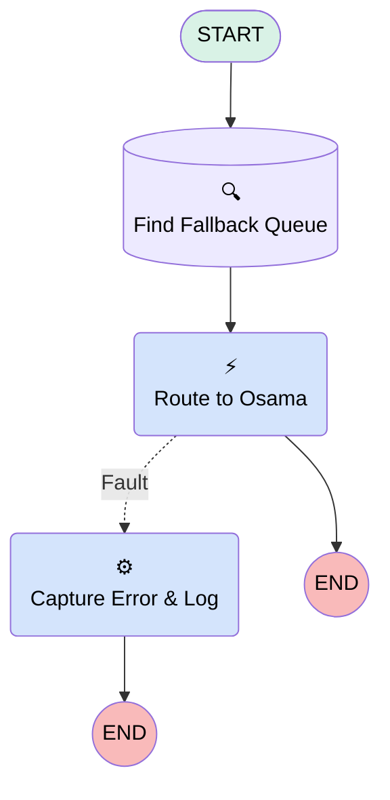

# Minlopro - Omni 🔱 - Route To Bot (Inbound)

## Flow Diagram

<!-- Flow description -->

## General Information

|<!-- -->|<!-- -->|
|:---|:---|
|Process Type|Routing Flow|
|Label|Minlopro - Omni 🔱 - Route To Bot (Inbound)|
|Status|Active|
|Description|TODO|
|Environments|Default|
|Interview Label|Minlopro_Omni_RouteToBot (Inbound) {!$Flow.CurrentDateTime}|
|BuilderType (PM)|LightningFlowBuilder|
|CanvasMode (PM)|AUTO_LAYOUT_CANVAS|
|OriginBuilderType (PM)|LightningFlowBuilder|
|Connector|[Find_Fallback_Queue](#find_fallback_queue)|
|Next Node|[Find_Fallback_Queue](#find_fallback_queue)|

## Variables

|Name|Data Type|Is Collection|Is Input|Is Output|Object Type|Description|
|:-- |:--:|:--:|:--:|:--:|:--:|:--  |
|recordId|String|⬜|✅|⬜|<!-- -->|<!-- -->|

## Flow Nodes Details

### Capture_Error_Log

|<!-- -->|<!-- -->|
|:---|:---|
|Type|Action Call|
|Label|Capture Error & Log|
|Action Type|Apex|
|Action Name|FlowLogger|
|Flow Transaction Model|Automatic|
|Name Segment|FlowLogger|
|Offset|0|
|level (input)|inputConfiguratorMode: Resource stringValue: ERROR |
|message (input)|elementReference: $Flow.FaultMessage inputConfiguratorMode: Resource |

### RoutingAction

|<!-- -->|<!-- -->|
|:---|:---|
|Type|Action Call|
|Label|Route to Osama|
|Action Type|Route Work|
|Action Name|routeWork|
|Description|Routes all messages to your enhanced bot.|
|Fault Connector|[Capture_Error_Log](#capture_error_log)|
|Flow Transaction Model|CurrentTransaction|
|Name Segment|routeWork|
|Offset|0|
|Version String|2.0.0|
|recordId (input)|recordId|
|serviceChannelLabel (input)|Messaging|
|serviceChannelDevName (input)|sfdc_livemessage|
|routingType (input)|Bot|
|routingConfigLabel (input)|<!-- -->|
|agentLabel (input)|<!-- -->|
|queueLabel (input)|<!-- -->|
|skillOption (input)|<!-- -->|
|skillRequirementsResourceItem (input)|<!-- -->|
|botLabel (input)|Osama|
|externalConversationBotLabel (input)|<!-- -->|
|copilotLabel (input)|<!-- -->|
|agentforceEmployeeAgentLabel (input)|<!-- -->|
|digitalWorkerLabel (input)|<!-- -->|
|isQueueVariable (input)|✅|
|routingStartOption (input)|<!-- -->|
|serviceChannelId (input)|setupReference: sfdc_livemessage setupReferenceType: ServiceChannel |
|routingConfigId (input)|<!-- -->|
|botId (input)|setupReference: Osama setupReferenceType: BotDefinition |
|copilotId (input)|<!-- -->|
|agentforceEmployeeAgentId (input)|<!-- -->|
|externalConversationBotId (input)|<!-- -->|
|digitalWorkerId (input)|<!-- -->|
|queueId (input)|Find_Fallback_Queue.Id|
|agentId (input)|<!-- -->|

### Find_Fallback_Queue

|<!-- -->|<!-- -->|
|:---|:---|
|Type|Record Lookup|
|Object|Group|
|Label|Find Fallback Queue|
|Assign Null Values If No Records Found|⬜|
|Get First Record Only|✅|
|Store Output Automatically|✅|
|Connector|[RoutingAction](#routingaction)|

#### Filters (logic: **and**)

|Filter Id|Field|Operator|Value|
|:-- |:-- |:--:|:--: |
|1|Type|Equal To|Queue|
|2|DeveloperName|Equal To|DigEx_SiteMessagingRequests|

___

_Documentation generated from branch develop by [sfdx-hardis](https://sfdx-hardis.cloudity.com), featuring [salesforce-flow-visualiser](https://github.com/toddhalfpenny/salesforce-flow-visualiser)_