# Minlopro - Opportunity - Auto-Close

## Flow Diagram

```mermaid
%% If you read this, your Markdown visualizer does not handle MermaidJS syntax.
%% - If you are in VsCode, install extension `Markdown Preview Mermaid Support` at https://marketplace.visualstudio.com/items?itemName=bierner.markdown-mermaid
%% - If you are using sfdx-hardis, try to define env variable `MERMAID_MODES=cli,docker` ,then run again the command to regenerate markdown with SVG images.
%% - If you are within mkdocs-material, define mermaid plugin in `mkdocs.yml` as described in https://squidfunk.github.io/mkdocs-material/extensions/mermaid/
%% - At last resort, you can copy-paste this MermaidJS code in https://mermaid.live/ to see the Flow Diagram

flowchart TB
START(["START<br/><b>AutoLaunched Flow</b></br>Type: <b> Record After Save</b>"]):::startClass
click START "#general-information" "1572747232"

Alert_Opportunity_Owner("⚡ <em></em><br/>Alert Opportunity Owner"):::actionCalls
click Alert_Opportunity_Owner "#alert_opportunity_owner" "2306736451"

Collect_Recipient_IDs[\"🟰 <em></em><br/>Collect Recipient IDs"/]:::assignments
click Collect_Recipient_IDs "#collect_recipient_ids" "1881570391"

Is_Opportunity_Already_Closed_1{"🔀 <em></em><br/>Is Opportunity Already Closed?"}:::decisions
click Is_Opportunity_Already_Closed_1 "#is_opportunity_already_closed_1" "2846048455"

Is_Opportunity_Already_Closed_2{"🔀 <em></em><br/>Is Opportunity Already Closed?"}:::decisions
click Is_Opportunity_Already_Closed_2 "#is_opportunity_already_closed_2" "304624806"

Get_Notification_Type[("🔍 <em></em><br/>Get Notification Type")]:::recordLookups
click Get_Notification_Type "#get_notification_type" "2370902395"

Close_Opportunity[("🛠️ <em></em><br/>Close Opportunity")]:::recordUpdates
click Close_Opportunity "#close_opportunity" "1227202588"

Alert_Opportunity_Owner --> END_Alert_Opportunity_Owner
Collect_Recipient_IDs --> Alert_Opportunity_Owner
Is_Opportunity_Already_Closed_1 --> |"No (Default Outcome)"| Get_Notification_Type
Is_Opportunity_Already_Closed_2 --> |"No (Default Outcome)"| Close_Opportunity
Get_Notification_Type --> Collect_Recipient_IDs
Close_Opportunity --> END_Close_Opportunity
START --> |"Alert Upcoming Autoclose"| Is_Opportunity_Already_Closed_1
START --> |"Autoclose Opportunity"| Is_Opportunity_Already_Closed_2
END_Alert_Opportunity_Owner(( END )):::endClass
END_Close_Opportunity(( END )):::endClass


classDef actionCalls fill:#D4E4FC,color:black,text-decoration:none,max-height:100px
classDef assignments fill:#FBEED7,color:black,text-decoration:none,max-height:100px
classDef collectionProcessors fill:#F0E3FA,color:black,text-decoration:none,max-height:100px
classDef customErrors fill:#FFE9E9,color:black,text-decoration:none,max-height:100px
classDef decisions fill:#FDEAF6,color:black,text-decoration:none,max-height:100px
classDef loops fill:#FDEAF6,color:black,text-decoration:none,max-height:100px
classDef recordCreates fill:#FFF8C9,color:black,text-decoration:none,max-height:100px
classDef recordDeletes fill:#FFF8C9,color:black,text-decoration:none,max-height:100px
classDef recordLookups fill:#EDEAFF,color:black,text-decoration:none,max-height:100px
classDef recordUpdates fill:#FFF8C9,color:black,text-decoration:none,max-height:100px
classDef screens fill:#DFF6FF,color:black,text-decoration:none,max-height:100px
classDef subflows fill:#D4E4FC,color:black,text-decoration:none,max-height:100px
classDef startClass fill:#D9F2E6,color:black,text-decoration:none,max-height:100px
classDef endClass fill:#F9BABA,color:black,text-decoration:none,max-height:100px
classDef transforms fill:#FDEAF6,color:black,text-decoration:none,max-height:100px


```

<!-- Flow description -->

## General Information

|<!-- -->|<!-- -->|
|:---|:---|
|Object|Opportunity|
|Process Type| Auto Launched Flow|
|Trigger Type| Record After Save|
|Record Trigger Type| Create And Update|
|Label|Minlopro - Opportunity - Auto-Close|
|Status|Active|
|Description|Monitors Opportunities by CloseDate. Alerts the Opportunity Owner 1 day before closure. On CloseDate, updates the stage to 'Auto-Closed' to keep the pipeline clean and up to date.|
|Environments|Default|
|Interview Label|Minlopro - Opportunity - Auto Close {!$Flow.CurrentDateTime}|
| Builder Type (PM)|LightningFlowBuilder|
| Canvas Mode (PM)|AUTO_LAYOUT_CANVAS|
| Origin Builder Type (PM)|LightningFlowBuilder|

#### Scheduled Paths

|Label|Name|Offset Number|Offset Unit|Record Field|Time Source|Connector|
|:-- |:-- |:-- |:-- |:-- |:-- |:--  |
|Alert Upcoming Autoclose|Alert_Upcoming_Autoclose|-2|Days|CloseDate|RecordField|[Is_Opportunity_Already_Closed_1](#is_opportunity_already_closed_1)|
|Autoclose Opportunity|Autoclose_Opportunity|1|Hours|CloseDate|RecordField|[Is_Opportunity_Already_Closed_2](#is_opportunity_already_closed_2)|

## Variables

|Name|Data Type|Is Collection|Is Input|Is Output|Object Type|Description|
|:-- |:--:|:--:|:--:|:--:|:--:|:--  |
|autocloseOppNotificationRecipientIds|String|✅|⬜|⬜|<!-- -->|<!-- -->|

## Formulas

|Name|Data Type|Expression|Description|
|:-- |:--:|:-- |:--  |
|autocloseOppNotificationBody|String|'Your opportunity will be closed soon.'|<!-- -->|
|autocloseOppNotificationTitle|String|'Upcoming Opportunity Auto-Closure: "' + {!$Record.Name} + '"'|<!-- -->|

## Flow Nodes Details

### Alert_Opportunity_Owner

|<!-- -->|<!-- -->|
|:---|:---|
|Type|Action Call|
|Label|Alert Opportunity Owner|
|Action Type|Custom Notification Action|
|Action Name|customNotificationAction|
|Flow Transaction Model|CurrentTransaction|
|Name Segment|customNotificationAction|
|Offset|0|
|Custom Notif Type Id (input)|Get_Notification_Type.Id|
|Recipient Ids (input)|autocloseOppNotificationRecipientIds|
|Title (input)|autocloseOppNotificationTitle|
|Body (input)|autocloseOppNotificationBody|
|Target Id (input)|$Record.Id|

### Collect_Recipient_IDs

|<!-- -->|<!-- -->|
|:---|:---|
|Type|Assignment|
|Label|Collect Recipient IDs|
|Connector|[Alert_Opportunity_Owner](#alert_opportunity_owner)|

#### Assignments

|Assign To Reference|Operator|Value|
|:-- |:--:|:--: |
|autocloseOppNotificationRecipientIds| Add|$Record.OwnerId|

### Is_Opportunity_Already_Closed_1

|<!-- -->|<!-- -->|
|:---|:---|
|Type|Decision|
|Label|Is Opportunity Already Closed?|
|Default Connector|[Get_Notification_Type](#get_notification_type)|
|Default Connector Label|No (Default Outcome)|

#### Rule Yes_1 (Yes)

|<!-- -->|<!-- -->|
|:---|:---|
|Condition Logic|and|

|Condition Id|Left Value Reference|Operator|Right Value|
|:-- |:-- |:--:|:--: |
|1|$Record.IsClosed| Equal To|✅|

### Is_Opportunity_Already_Closed_2

|<!-- -->|<!-- -->|
|:---|:---|
|Type|Decision|
|Label|Is Opportunity Already Closed?|
|Default Connector|[Close_Opportunity](#close_opportunity)|
|Default Connector Label|No (Default Outcome)|

#### Rule Yes_2 (Yes)

|<!-- -->|<!-- -->|
|:---|:---|
|Condition Logic|and|

|Condition Id|Left Value Reference|Operator|Right Value|
|:-- |:-- |:--:|:--: |
|1|$Record.IsClosed| Equal To|✅|

### Get_Notification_Type

|<!-- -->|<!-- -->|
|:---|:---|
|Type|Record Lookup|
|Object|CustomNotificationType|
|Label|Get Notification Type|
|Assign Null Values If No Records Found|⬜|
|Get First Record Only|✅|
|Store Output Automatically|✅|
|Connector|[Collect_Recipient_IDs](#collect_recipient_ids)|

#### Filters (logic: **and**)

|Filter Id|Field|Operator|Value|
|:-- |:-- |:--:|:--: |
|1|DeveloperName| Equal To|Minlopro|

### Close_Opportunity

|<!-- -->|<!-- -->|
|:---|:---|
|Type|Record Update|
|Label|Close Opportunity|
|Input Reference|$Record|

#### Input Assignments

|Field|Value|
|:-- |:--: |
|StageName|Auto-Closed|

___

_Documentation generated from branch develop by [sfdx-hardis](https://sfdx-hardis.cloudity.com), featuring [salesforce-flow-visualiser](https://github.com/toddhalfpenny/salesforce-flow-visualiser)_