# Minlopro - Opportunity - Before Save

## Flow Diagram

```mermaid
%% If you read this, your Markdown visualizer does not handle MermaidJS syntax.
%% - If you are in VsCode, install extension `Markdown Preview Mermaid Support` at https://marketplace.visualstudio.com/items?itemName=bierner.markdown-mermaid
%% - If you are using sfdx-hardis, try to define env variable `MERMAID_MODES=cli,docker` ,then run again the command to regenerate markdown with SVG images.
%% - If you are within mkdocs-material, define mermaid plugin in `mkdocs.yml` as described in https://squidfunk.github.io/mkdocs-material/extensions/mermaid/
%% - At last resort, you can copy-paste this MermaidJS code in https://mermaid.live/ to see the Flow Diagram

flowchart TB
START(["START<br/><b>AutoLaunched Flow</b></br>Type: <b> Record Before Save</b>"]):::startClass
click START "#general-information" "977758777"

Set_Default_Close_Date[\"🟰 <em></em><br/>Set Default Close Date"/]:::assignments
click Set_Default_Close_Date "#set_default_close_date" "1038760774"

Invalid_CloseDate_Alert("🚫 <em></em><br/>Invalid CloseDate Alert"):::customErrors
click Invalid_CloseDate_Alert "#invalid_closedate_alert" "1956058341"

Is_Close_Date_In_Valid_Range{"🔀 <em></em><br/>Is Close Date In Valid Range?"}:::decisions
click Is_Close_Date_In_Valid_Range "#is_close_date_in_valid_range" "2476133571"

Set_Default_Close_Date --> Is_Close_Date_In_Valid_Range
Invalid_CloseDate_Alert --> END_Invalid_CloseDate_Alert
Is_Close_Date_In_Valid_Range --> |"Date Range Is Invalid"| Invalid_CloseDate_Alert
Is_Close_Date_In_Valid_Range --> |"Default Outcome"| END_Is_Close_Date_In_Valid_Range
START -->  Set_Default_Close_Date
END_Invalid_CloseDate_Alert(( END )):::endClass
END_Is_Close_Date_In_Valid_Range(( END )):::endClass


classDef actionCalls fill:#D4E4FC,color:black,text-decoration:none,max-height:100px
classDef assignments fill:#FBEED7,color:black,text-decoration:none,max-height:100px
classDef collectionProcessors fill:#F0E3FA,color:black,text-decoration:none,max-height:100px
classDef customErrors fill:#FFE9E9,color:black,text-decoration:none,max-height:100px
classDef decisions fill:#FDEAF6,color:black,text-decoration:none,max-height:100px
classDef loops fill:#FDEAF6,color:black,text-decoration:none,max-height:100px
classDef recordCreates fill:#FFF8C9,color:black,text-decoration:none,max-height:100px
classDef recordDeletes fill:#FFF8C9,color:black,text-decoration:none,max-height:100px
classDef recordLookups fill:#EDEAFF,color:black,text-decoration:none,max-height:100px
classDef recordUpdates fill:#FFF8C9,color:black,text-decoration:none,max-height:100px
classDef screens fill:#DFF6FF,color:black,text-decoration:none,max-height:100px
classDef subflows fill:#D4E4FC,color:black,text-decoration:none,max-height:100px
classDef startClass fill:#D9F2E6,color:black,text-decoration:none,max-height:100px
classDef endClass fill:#F9BABA,color:black,text-decoration:none,max-height:100px
classDef transforms fill:#FDEAF6,color:black,text-decoration:none,max-height:100px


```

<!-- Flow description -->

## General Information

|<!-- -->|<!-- -->|
|:---|:---|
|Object|Opportunity|
|Process Type| Auto Launched Flow|
|Trigger Type| Record Before Save|
|Record Trigger Type| Create And Update|
|Label|Minlopro - Opportunity - Before Save|
|Status|Active|
|Description|RTF for Opportunity object that handles BEFORE INSERT and/or BEFORE UPDATE phases.|
|Environments|Default|
|Interview Label|Minlopro - Opportunity - Before Save {!$Flow.CurrentDateTime}|
| Builder Type (PM)|LightningFlowBuilder|
| Canvas Mode (PM)|AUTO_LAYOUT_CANVAS|
| Origin Builder Type (PM)|LightningFlowBuilder|
|Connector|[Set_Default_Close_Date](#set_default_close_date)|
|Next Node|[Set_Default_Close_Date](#set_default_close_date)|

## Formulas

|Name|Data Type|Expression|Description|
|:-- |:--:|:-- |:--  |
|isCloseDateWithinNDays|Boolean|TODAY() + {!nextCloseDateDaysLimit} >= {!normalizedCloseDate}|Ensures the CloseDate is on or before N days from today (N = 20 days).|
|normalizedCloseDate|Date|IF(ISBLANK({!$Record.CloseDate}), {!$Flow.CurrentDate} + 5, {!$Record.CloseDate})|Defaults 'CloseDate' to 5 days from now if not set.|

## Constants

|Name|Data Type|Value|Description|
|:-- |:--:|:--:|:--  |
|nextCloseDateDaysLimit|Number|60|<!-- -->|

## Flow Nodes Details

### Set_Default_Close_Date

|<!-- -->|<!-- -->|
|:---|:---|
|Type|Assignment|
|Label|Set Default Close Date|
|Connector|[Is_Close_Date_In_Valid_Range](#is_close_date_in_valid_range)|

#### Assignments

|Assign To Reference|Operator|Value|
|:-- |:--:|:--: |
|$Record.CloseDate| Assign|normalizedCloseDate|

### Invalid_CloseDate_Alert

|<!-- -->|<!-- -->|
|:---|:---|
|Type|Custom Error|
|Label|Invalid CloseDate Alert|
|Custom Error Messages|- errorMessage: >- &nbsp;&nbsp;&nbsp;&nbsp;Close Date must be within the next {!nextCloseDateDaysLimit} day(s) from &nbsp;&nbsp;&nbsp;&nbsp;today. &nbsp;&nbsp;isFieldError: false - errorMessage: >- &nbsp;&nbsp;&nbsp;&nbsp;Please select a date no later than {!nextCloseDateDaysLimit} day(s) from &nbsp;&nbsp;&nbsp;&nbsp;today. &nbsp;&nbsp;fieldSelection: CloseDate &nbsp;&nbsp;isFieldError: true |

### Is_Close_Date_In_Valid_Range

|<!-- -->|<!-- -->|
|:---|:---|
|Type|Decision|
|Label|Is Close Date In Valid Range?|
|Default Connector Label|Default Outcome|

#### Rule Date_Range_Is_Invalid (Date Range Is Invalid)

|<!-- -->|<!-- -->|
|:---|:---|
|Connector|[Invalid_CloseDate_Alert](#invalid_closedate_alert)|
|Condition Logic|and|

|Condition Id|Left Value Reference|Operator|Right Value|
|:-- |:-- |:--:|:--: |
|1|isCloseDateWithinNDays| Equal To|⬜|

___

_Documentation generated from branch develop by [sfdx-hardis](https://sfdx-hardis.cloudity.com), featuring [salesforce-flow-visualiser](https://github.com/toddhalfpenny/salesforce-flow-visualiser)_