# Minlopro - Search Account

## Flow Diagram

```mermaid
%% If you read this, your Markdown visualizer does not handle MermaidJS syntax.
%% - If you are in VsCode, install extension `Markdown Preview Mermaid Support` at https://marketplace.visualstudio.com/items?itemName=bierner.markdown-mermaid
%% - If you are using sfdx-hardis, try to define env variable `MERMAID_MODES=cli,docker` ,then run again the command to regenerate markdown with SVG images.
%% - If you are within mkdocs-material, define mermaid plugin in `mkdocs.yml` as described in https://squidfunk.github.io/mkdocs-material/extensions/mermaid/
%% - At last resort, you can copy-paste this MermaidJS code in https://mermaid.live/ to see the Flow Diagram

flowchart TB
START(["START<br/><b>Screen Flow</b>"]):::startClass
click START "#general-information" "2395480504"

Search_Accounts_via_HTTP_GET("⚡ <em></em><br/>Search Accounts via HTTP GET"):::actionCalls
click Search_Accounts_via_HTTP_GET "#search_accounts_via_http_get" "4068503304"

Compute_Found_Accounts_Size[\"🟰 <em></em><br/>Compute Found Accounts Size"/]:::assignments
click Compute_Found_Accounts_Size "#compute_found_accounts_size" "2238984410"

Has_Account_Selected{"🔀 <em></em><br/>Has Account Selected?"}:::decisions
click Has_Account_Selected "#has_account_selected" "2546833255"

Callout_Error_Screen(["💻 <em></em><br/>Callout Error Screen"]):::screens
click Callout_Error_Screen "#callout_error_screen" "872223558"

Force_Account_Selection_Screen(["💻 <em></em><br/>Force Account Selection Screen"]):::screens
click Force_Account_Selection_Screen "#force_account_selection_screen" "2675345591"

Query_Results_Screen(["💻 <em></em><br/>Query Results Screen"]):::screens
click Query_Results_Screen "#query_results_screen" "2633126035"

Search_Keyword_Screen(["💻 <em></em><br/>Search Keyword Screen"]):::screens
click Search_Keyword_Screen "#search_keyword_screen" "3449864410"

Cast_Search_Results_To_Accounts{{"♻️ <em></em><br/>Cast Search Results To Accounts"}}:::transforms
click Cast_Search_Results_To_Accounts "#cast_search_results_to_accounts" "3797680224"

Search_Accounts_via_HTTP_GET --> Compute_Found_Accounts_Size
Search_Accounts_via_HTTP_GET -. Fault .->Callout_Error_Screen
Compute_Found_Accounts_Size --> Cast_Search_Results_To_Accounts
Has_Account_Selected --> |"Account Was Not Selected"| Force_Account_Selection_Screen
Has_Account_Selected --> |"Account Was Selected"| END_Has_Account_Selected
Callout_Error_Screen --> END_Callout_Error_Screen
Force_Account_Selection_Screen --> Query_Results_Screen
Query_Results_Screen --> Has_Account_Selected
Search_Keyword_Screen --> Search_Accounts_via_HTTP_GET
START -->  Search_Keyword_Screen
Cast_Search_Results_To_Accounts --> Query_Results_Screen
END_Has_Account_Selected(( END )):::endClass
END_Callout_Error_Screen(( END )):::endClass


classDef actionCalls fill:#D4E4FC,color:black,text-decoration:none,max-height:100px
classDef assignments fill:#FBEED7,color:black,text-decoration:none,max-height:100px
classDef collectionProcessors fill:#F0E3FA,color:black,text-decoration:none,max-height:100px
classDef customErrors fill:#FFE9E9,color:black,text-decoration:none,max-height:100px
classDef decisions fill:#FDEAF6,color:black,text-decoration:none,max-height:100px
classDef loops fill:#FDEAF6,color:black,text-decoration:none,max-height:100px
classDef recordCreates fill:#FFF8C9,color:black,text-decoration:none,max-height:100px
classDef recordDeletes fill:#FFF8C9,color:black,text-decoration:none,max-height:100px
classDef recordLookups fill:#EDEAFF,color:black,text-decoration:none,max-height:100px
classDef recordUpdates fill:#FFF8C9,color:black,text-decoration:none,max-height:100px
classDef screens fill:#DFF6FF,color:black,text-decoration:none,max-height:100px
classDef subflows fill:#D4E4FC,color:black,text-decoration:none,max-height:100px
classDef startClass fill:#D9F2E6,color:black,text-decoration:none,max-height:100px
classDef endClass fill:#F9BABA,color:black,text-decoration:none,max-height:100px
classDef transforms fill:#FDEAF6,color:black,text-decoration:none,max-height:100px


```

<!-- Flow description -->

## General Information

|<!-- -->|<!-- -->|
|:---|:---|
|Process Type| Flow|
|Label|Minlopro - Search Account|
|Status|Active|
|Description|Screen Flow that searches for Account records through SOSL query.|
|Environments|Default|
|Interview Label|Minlopro - Search Account {!$Flow.CurrentDateTime}|
| Builder Type (PM)|LightningFlowBuilder|
| Canvas Mode (PM)|AUTO_LAYOUT_CANVAS|
| Origin Builder Type (PM)|LightningFlowBuilder|
|Connector|[Search_Keyword_Screen](#search_keyword_screen)|
|Next Node|[Search_Keyword_Screen](#search_keyword_screen)|

## Variables

|Name|Data Type|Is Collection|Is Input|Is Output|Object Type|Description|
|:-- |:--:|:--:|:--:|:--:|:--:|:--  |
|foundAccounts|Apex|⬜|⬜|⬜|<!-- -->|<!-- -->|
|foundAccountsSize|Number|⬜|⬜|⬜|<!-- -->|<!-- -->|
|selectedAccount|SObject|⬜|⬜|✅|Account|Output Account variable selected by running user|

## Formulas

|Name|Data Type|Expression|Description|
|:-- |:--:|:-- |:--  |
|soslQuery|String|'FIND {' + {!Account_Search_Keyword} + '} IN NAME FIELDS RETURNING Account(Id, Name, Description) LIMIT 10'|<!-- -->|

## Flow Nodes Details

### Search_Accounts_via_HTTP_GET

|<!-- -->|<!-- -->|
|:---|:---|
|Type|Action Call|
|Label|Search Accounts via HTTP GET|
|Action Type|External Service|
|Action Name|MinloproSearchAccount.Search Accounts|
|Fault Connector|[Callout_Error_Screen](#callout_error_screen)|
|Flow Transaction Model|Automatic|
|Name Segment|MinloproSearchAccount.Search Accounts|
|Offset|0|
|Output Parameters|assignToReference: foundAccounts name: 2XX |
|Q (input)|soslQuery|
|Connector|[Compute_Found_Accounts_Size](#compute_found_accounts_size)|

### Compute_Found_Accounts_Size

|<!-- -->|<!-- -->|
|:---|:---|
|Type|Assignment|
|Label|Compute Found Accounts Size|
|Connector|[Cast_Search_Results_To_Accounts](#cast_search_results_to_accounts)|

#### Assignments

|Assign To Reference|Operator|Value|
|:-- |:--:|:--: |
|foundAccountsSize| Assign Count|foundAccounts.searchRecords|

### Has_Account_Selected

|<!-- -->|<!-- -->|
|:---|:---|
|Type|Decision|
|Label|Has Account Selected?|
|Default Connector Label|Account Was Selected|

#### Rule Account_Was_Not_Selected (Account Was Not Selected)

|<!-- -->|<!-- -->|
|:---|:---|
|Connector|[Force_Account_Selection_Screen](#force_account_selection_screen)|
|Condition Logic|and|

|Condition Id|Left Value Reference|Operator|Right Value|
|:-- |:-- |:--:|:--: |
|1|selectedAccount.Id| Is Null|✅|

### Callout_Error_Screen

|<!-- -->|<!-- -->|
|:---|:---|
|Type|Screen|
|Label|Callout Error Screen|
|Allow Back|⬜|
|Allow Finish|✅|
|Allow Pause|⬜|
|Next Or Finish Button Label|Close|
|Show Footer|✅|
|Show Header|✅|

#### CalloutErrorText

|<!-- -->|<!-- -->|
|:---|:---|
|Field Text|
HTTP callout failed with <strong style="font-size: 14px; color: rgb(195, 32, 32);">{!$Flow.FaultMessage}</strong> error.
|
|Field Type| Display Text|

### Force_Account_Selection_Screen

|<!-- -->|<!-- -->|
|:---|:---|
|Type|Screen|
|Label|Force Account Selection Screen|
|Allow Back|✅|
|Allow Finish|⬜|
|Allow Pause|⬜|
|Back Button Label|Back|
|Show Footer|✅|
|Show Header|✅|
|Connector|isGoTo: true targetReference: Query_Results_Screen |

#### ForceAccountSelectionText

|<!-- -->|<!-- -->|
|:---|:---|
|Field Text|
Looks like you forgot to choose the Account.Ôªø

Please, go back to the previous screen and make your selection.
|
|Field Type| Display Text|

### Query_Results_Screen

|<!-- -->|<!-- -->|
|:---|:---|
|Type|Screen|
|Label|Query Results Screen|
|Allow Back|✅|
|Allow Finish|✅|
|Allow Pause|⬜|
|Back Button Label|Re-Enter Search Keyword|
|Next Or Finish Button Label|Select & Proceed|
|Show Footer|✅|
|Show Header|✅|
|Connector|[Has_Account_Selected](#has_account_selected)|

#### NoResultsFoundText

|<!-- -->|<!-- -->|
|:---|:---|
|Field Text|
<em style="font-size: 14px;">No Accounts were found by '</em><strong style="font-size: 14px;"><em>{!Account_Search_Keyword}</em></strong><em style="font-size: 14px;">' search keyword. Try another one!</em>
|
|Field Type| Display Text|
|Visibility Rule|conditionLogic: and conditions: &nbsp;&nbsp;leftValueReference: foundAccountsSize &nbsp;&nbsp;operator: EqualTo &nbsp;&nbsp;rightValue: &nbsp;&nbsp;&nbsp;&nbsp;numberValue: 0 |

#### FoundAccountsTable

|<!-- -->|<!-- -->|
|:---|:---|
|Data Type Mappings|typeName: T typeValue: Account |
|Extension Name|flowruntime:datatable|
|Field Type| Component Instance|
|Inputs On Next Nav To Assoc Scrn| Reset Values|
|Is Required|✅|
|Output Parameters|assignToReference: selectedAccount name: firstSelectedRow |
|Visibility Rule|conditionLogic: and conditions: &nbsp;&nbsp;leftValueReference: foundAccountsSize &nbsp;&nbsp;operator: GreaterThan &nbsp;&nbsp;rightValue: &nbsp;&nbsp;&nbsp;&nbsp;numberValue: 0 |
|Label (input)|Found Accounts|
|Selection Mode (input)|SINGLE_SELECT|
|Min Row Selection (input)|numberValue: 0 |
|Should Display Label (input)|✅|
|Table Data (input)|[Cast_Search_Results_To_Accounts](#cast_search_results_to_accounts)|
|Columns (input)|[{"apiName":"Name","guid":"column-ffa0","editable":false,"hasCustomHeaderLabel":false,"customHeaderLabel":"","wrapText":true,"order":0,"label":"Account Name","type":"text"},{"apiName":"Id","guid":"column-2c6b","editable":false,"hasCustomHeaderLabel":true,"customHeaderLabel":"Record ID","wrapText":true,"order":1,"label":"Account ID","type":"text"},{"apiName":"Description","guid":"column-5a4b","editable":false,"hasCustomHeaderLabel":false,"customHeaderLabel":"","wrapText":true,"order":2,"label":"Account Description","type":"text"}]|
|Max Row Selection (input)|1|

### Search_Keyword_Screen

|<!-- -->|<!-- -->|
|:---|:---|
|Type|Screen|
|Label|Search Keyword Screen|
|Allow Back|⬜|
|Allow Finish|✅|
|Allow Pause|⬜|
|Next Or Finish Button Label|Search|
|Show Footer|✅|
|Show Header|✅|
|Connector|[Search_Accounts_via_HTTP_GET](#search_accounts_via_http_get)|

#### Account_Search_Keyword

|<!-- -->|<!-- -->|
|:---|:---|
|Data Type|String|
|Field Text|Account Search Keyword|
|Field Type| Input Field|
|Help Text|
Type in keyword to search for Account(s)
|
|Inputs On Next Nav To Assoc Scrn| Reset Values|
|Is Required|✅|
|Validation Rule|errorMessage: 
Keyword should be 2 characters at least
 formulaExpression: LEN({!Account_Search_Keyword}) >= 2 |

### Cast_Search_Results_To_Accounts

|<!-- -->|<!-- -->|
|:---|:---|
|Type|Transform|
|Label|Cast Search Results To Accounts|
|Data Type|SObject|
|Object Type|Account|
|Is Collection|✅|
|Scale|0|
|Store Output Automatically|✅|
|Connector|[Query_Results_Screen](#query_results_screen)|

#### Transform actions

|Transform Type|Value|Output Field Api Name|
|:-- |:--:|:--  |
|Map|foundAccounts.searchRecords[$EachItem].Id|Id|
|Map|foundAccounts.searchRecords[$EachItem].Name|Name|
|Map|foundAccounts.searchRecords[$EachItem].Description|Description|

___

_Documentation generated from branch develop by [sfdx-hardis](https://sfdx-hardis.cloudity.com), featuring [salesforce-flow-visualiser](https://github.com/toddhalfpenny/salesforce-flow-visualiser)_