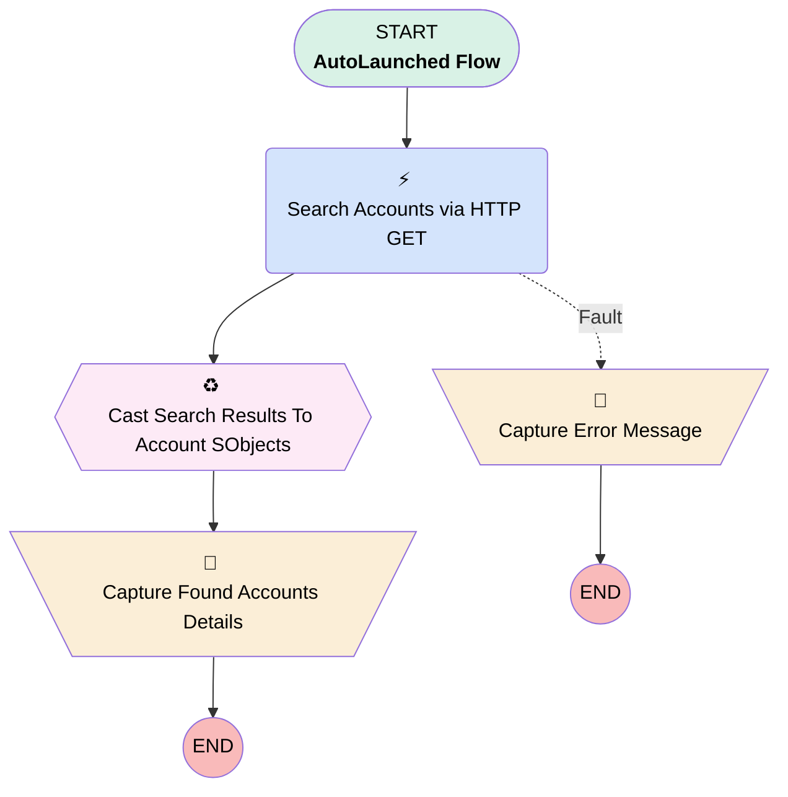

# Minlopro - Search Account (Headless Action)

## Flow Diagram

<!-- Flow description -->

## General Information

|<!-- -->|<!-- -->|
|:---|:---|
|Process Type| Auto Launched Flow|
|Label|Minlopro - Search Account (Headless Action)|
|Status|Active|
|Description|Headless auto-launched flow that searches for Account records via SOSL query.|
|Environments|Default|
|Interview Label|Minlopro - Search {!$Flow.CurrentDateTime}|
| Builder Type (PM)|LightningFlowBuilder|
| Canvas Mode (PM)|AUTO_LAYOUT_CANVAS|
| Origin Builder Type (PM)|LightningFlowBuilder|
|Connector|[Search_Accounts_via_HTTP_GET](#search_accounts_via_http_get)|
|Next Node|[Search_Accounts_via_HTTP_GET](#search_accounts_via_http_get)|

## Variables

|Name|Data Type|Is Collection|Is Input|Is Output|Object Type|Description|
|:-- |:--:|:--:|:--:|:--:|:--:|:--  |
|errorMessage|String|⬜|⬜|✅|<!-- -->|<!-- -->|
|foundAccounts|SObject|✅|⬜|✅|Account|<!-- -->|
|foundAccountsAsJson|Apex|⬜|⬜|⬜|<!-- -->|<!-- -->|
|foundAccountsSize|Number|⬜|⬜|✅|<!-- -->|<!-- -->|
|searchKeyword|String|⬜|✅|⬜|<!-- -->|<!-- -->|

## Formulas

|Name|Data Type|Expression|Description|
|:-- |:--:|:-- |:--  |
|soslQuery|String|'FIND {' + {!searchKeyword} + '} IN NAME FIELDS RETURNING Account(Id, Name, Description) LIMIT 10'|<!-- -->|

## Flow Nodes Details

### Search_Accounts_via_HTTP_GET

|<!-- -->|<!-- -->|
|:---|:---|
|Type|Action Call|
|Label|Search Accounts via HTTP GET|
|Action Type|External Service|
|Action Name|MinloproSearchAccount.Search Accounts|
|Fault Connector|[Capture_Error_Message](#capture_error_message)|
|Flow Transaction Model|Automatic|
|Name Segment|MinloproSearchAccount.Search Accounts|
|Offset|0|
|Output Parameters|assignToReference: foundAccountsAsJson name: 2XX |
|Q (input)|soslQuery|
|Connector|[Cast_Search_Results_To_Account_SObjects](#cast_search_results_to_account_sobjects)|

### Capture_Error_Message

|<!-- -->|<!-- -->|
|:---|:---|
|Type|Assignment|
|Label|Capture Error Message|

#### Assignments

|Assign To Reference|Operator|Value|
|:-- |:--:|:--: |
|errorMessage| Assign|$Flow.FaultMessage|

### Capture_Found_Accounts_Details

|<!-- -->|<!-- -->|
|:---|:---|
|Type|Assignment|
|Label|Capture Found Accounts Details|

#### Assignments

|Assign To Reference|Operator|Value|
|:-- |:--:|:--: |
|foundAccounts| Assign|[Cast_Search_Results_To_Account_SObjects](#cast_search_results_to_account_sobjects)|
|foundAccountsSize| Assign Count|foundAccounts|

### Cast_Search_Results_To_Account_SObjects

|<!-- -->|<!-- -->|
|:---|:---|
|Type|Transform|
|Label|Cast Search Results To Account SObjects|
|Data Type|SObject|
|Object Type|Account|
|Is Collection|✅|
|Scale|0|
|Store Output Automatically|✅|
|Connector|[Capture_Found_Accounts_Details](#capture_found_accounts_details)|

#### Transform actions

|Transform Type|Value|Output Field Api Name|
|:-- |:--:|:--  |
|Map|foundAccountsAsJson.searchRecords[$EachItem].Description|Description|
|Map|foundAccountsAsJson.searchRecords[$EachItem].Id|Id|
|Map|foundAccountsAsJson.searchRecords[$EachItem].Name|Name|

___

_Documentation generated from branch develop by [sfdx-hardis](https://sfdx-hardis.cloudity.com), featuring [salesforce-flow-visualiser](https://github.com/toddhalfpenny/salesforce-flow-visualiser)_