# Minlopro - Send GitHub Webhook Notification

## Flow Diagram

```mermaid
%% If you read this, your Markdown visualizer does not handle MermaidJS syntax.
%% - If you are in VsCode, install extension `Markdown Preview Mermaid Support` at https://marketplace.visualstudio.com/items?itemName=bierner.markdown-mermaid
%% - If you are using sfdx-hardis, try to define env variable `MERMAID_MODES=cli,docker` ,then run again the command to regenerate markdown with SVG images.
%% - If you are within mkdocs-material, define mermaid plugin in `mkdocs.yml` as described in https://squidfunk.github.io/mkdocs-material/extensions/mermaid/
%% - At last resort, you can copy-paste this MermaidJS code in https://mermaid.live/ to see the Flow Diagram

flowchart TB
START(["START<br/><b>AutoLaunched Flow</b></br>"]):::startClass
click START "#general-information" "2390665810"

Send_Custom_Notification("⚡ <em></em><br/>Send Custom Notification"):::actionCalls
click Send_Custom_Notification "#send_custom_notification" "4037713225"

Get_Custom_Notification_Type[("🔍 <em></em><br/>Get Custom Notification Type")]:::recordLookups
click Get_Custom_Notification_Type "#get_custom_notification_type" "1402575108"

Send_Custom_Notification --> END_Send_Custom_Notification
Get_Custom_Notification_Type --> Send_Custom_Notification
START -->  Get_Custom_Notification_Type
END_Send_Custom_Notification(( END )):::endClass


classDef actionCalls fill:#D4E4FC,color:black,text-decoration:none,max-height:100px
classDef assignments fill:#FBEED7,color:black,text-decoration:none,max-height:100px
classDef collectionProcessors fill:#F0E3FA,color:black,text-decoration:none,max-height:100px
classDef customErrors fill:#FFE9E9,color:black,text-decoration:none,max-height:100px
classDef decisions fill:#FDEAF6,color:black,text-decoration:none,max-height:100px
classDef loops fill:#FDEAF6,color:black,text-decoration:none,max-height:100px
classDef recordCreates fill:#FFF8C9,color:black,text-decoration:none,max-height:100px
classDef recordDeletes fill:#FFF8C9,color:black,text-decoration:none,max-height:100px
classDef recordLookups fill:#EDEAFF,color:black,text-decoration:none,max-height:100px
classDef recordUpdates fill:#FFF8C9,color:black,text-decoration:none,max-height:100px
classDef screens fill:#DFF6FF,color:black,text-decoration:none,max-height:100px
classDef subflows fill:#D4E4FC,color:black,text-decoration:none,max-height:100px
classDef startClass fill:#D9F2E6,color:black,text-decoration:none,max-height:100px
classDef endClass fill:#F9BABA,color:black,text-decoration:none,max-height:100px


```

<!-- Flow description -->

## General Information

|<!-- -->|<!-- -->|
|:---|:---|
|Process Type| Auto Launched Flow|
|Label|Minlopro - Send GitHub Webhook Notification|
|Status|Active|
|Description|Intended to be launched on behalf of site guest user, but executed in system mode with permission to send custom         notifications.|
|Environments|Default|
|Interview Label|Minlopto {!$Flow.CurrentDateTime}|
|Run In Mode| System Mode Without Sharing|
| Builder Type (PM)|LightningFlowBuilder|
| Canvas Mode (PM)|AUTO_LAYOUT_CANVAS|
| Origin Builder Type (PM)|LightningFlowBuilder|
|Connector|[Get_Custom_Notification_Type](#get_custom_notification_type)|
|Next Node|[Get_Custom_Notification_Type](#get_custom_notification_type)|

## Variables

|Name|Data Type|Is Collection|Is Input|Is Output|Object Type|Description|
|:-- |:--:|:--:|:--:|:--:|:--:|:--  |
|message|String|⬜|✅|⬜|<!-- -->|<!-- -->|
|recipientIds|String|✅|✅|⬜|<!-- -->|<!-- -->|
|targetPageRef|String|⬜|✅|⬜|<!-- -->|<!-- -->|

## Constants

|Name|Data Type|Value|Description|
|:-- |:--:|:--:|:--  |
|customNotificationTypeName|String|GitHubWebhookEvent|<!-- -->|
|title|String|GitHub Webhook Alert|<!-- -->|

## Flow Nodes Details

### Send_Custom_Notification

|<!-- -->|<!-- -->|
|:---|:---|
|Type|Action Call|
|Label|Send Custom Notification|
|Action Type|Custom Notification Action|
|Action Name|customNotificationAction|
|Flow Transaction Model|CurrentTransaction|
|Name Segment|customNotificationAction|
|Version Segment|1|
|Custom Notif Type Id (input)|Get_Custom_Notification_Type.Id|
|Recipient Ids (input)|recipientIds|
|Title (input)|title|
|Body (input)|message|
|Target Page Ref (input)|targetPageRef|

### Get_Custom_Notification_Type

|<!-- -->|<!-- -->|
|:---|:---|
|Type|Record Lookup|
|Object|CustomNotificationType|
|Label|Get Custom Notification Type|
|Description|DeveloperName = 'GitHubWebhookEvent'|
|Assign Null Values If No Records Found|⬜|
|Get First Record Only|✅|
|Store Output Automatically|✅|
|Connector|[Send_Custom_Notification](#send_custom_notification)|

#### Filters (logic: **and**)

|Filter Id|Field|Operator|Value|
|:-- |:-- |:--:|:--: |
|1|DeveloperName| Equal To|customNotificationTypeName|

___

_Documentation generated from branch develop by [sfdx-hardis](https://sfdx-hardis.cloudity.com), featuring [salesforce-flow-visualiser](https://github.com/toddhalfpenny/salesforce-flow-visualiser)_