# Minlopro - Send Opt-In Email To Account

## Flow Diagram

```mermaid
%% If you read this, your Markdown visualizer does not handle MermaidJS syntax.
%% - If you are in VsCode, install extension `Markdown Preview Mermaid Support` at https://marketplace.visualstudio.com/items?itemName=bierner.markdown-mermaid
%% - If you are using sfdx-hardis, try to define env variable `MERMAID_MODES=cli,docker` ,then run again the command to regenerate markdown with SVG images.
%% - If you are within mkdocs-material, define mermaid plugin in `mkdocs.yml` as described in https://squidfunk.github.io/mkdocs-material/extensions/mermaid/
%% - At last resort, you can copy-paste this MermaidJS code in https://mermaid.live/ to see the Flow Diagram

flowchart TB
START(["START<br/><b>Screen Flow</b>"]):::startClass
click START "#general-information" "505386440"

SendOptInEmail("⚙️ <em></em><br/>Send Opt-In Email"):::actionCalls
click SendOptInEmail "#sendoptinemail" "1574204693"

GetAccount[("🔍 <em></em><br/>Get Account")]:::recordLookups
click GetAccount "#getaccount" "1554691190"

GetEmailTemplate[("🔍 <em></em><br/>Get Email Template")]:::recordLookups
click GetEmailTemplate "#getemailtemplate" "2402338847"

EmailPreviewScreen(["💻 <em></em><br/>Email Preview Screen"]):::screens
click EmailPreviewScreen "#emailpreviewscreen" "2004207161"

SendErrorScreen(["💻 <em></em><br/>Send Error Screen"]):::screens
click SendErrorScreen "#senderrorscreen" "1154621978"

SendOptInEmail --> END_SendOptInEmail
SendOptInEmail -. Fault .->SendErrorScreen
GetAccount --> GetEmailTemplate
GetEmailTemplate --> EmailPreviewScreen
EmailPreviewScreen --> SendOptInEmail
SendErrorScreen --> END_SendErrorScreen
START -->  GetAccount
END_SendOptInEmail(( END )):::endClass
END_SendErrorScreen(( END )):::endClass


classDef actionCalls fill:#D4E4FC,color:black,text-decoration:none,max-height:100px
classDef assignments fill:#FBEED7,color:black,text-decoration:none,max-height:100px
classDef collectionProcessors fill:#F0E3FA,color:black,text-decoration:none,max-height:100px
classDef customErrors fill:#FFE9E9,color:black,text-decoration:none,max-height:100px
classDef decisions fill:#FDEAF6,color:black,text-decoration:none,max-height:100px
classDef loops fill:#FDEAF6,color:black,text-decoration:none,max-height:100px
classDef recordCreates fill:#FFF8C9,color:black,text-decoration:none,max-height:100px
classDef recordDeletes fill:#FFF8C9,color:black,text-decoration:none,max-height:100px
classDef recordLookups fill:#EDEAFF,color:black,text-decoration:none,max-height:100px
classDef recordUpdates fill:#FFF8C9,color:black,text-decoration:none,max-height:100px
classDef screens fill:#DFF6FF,color:black,text-decoration:none,max-height:100px
classDef subflows fill:#D4E4FC,color:black,text-decoration:none,max-height:100px
classDef startClass fill:#D9F2E6,color:black,text-decoration:none,max-height:100px
classDef endClass fill:#F9BABA,color:black,text-decoration:none,max-height:100px
classDef transforms fill:#FDEAF6,color:black,text-decoration:none,max-height:100px


```

<!-- Flow description -->

## General Information

|<!-- -->|<!-- -->|
|:---|:---|
|Process Type| Flow|
|Label|Minlopro - Send Opt-In Email To Account|
|Status|Active|
|Description|Used to POC outbound & inbound email sends from/to Account record.|
|Environments|Default|
|Interview Label|Minlopro - Send Opt-In Email To Account {!$Flow.CurrentDateTime}|
| Builder Type (PM)|LightningFlowBuilder|
| Canvas Mode (PM)|AUTO_LAYOUT_CANVAS|
| Origin Builder Type (PM)|LightningFlowBuilder|
|Connector|[GetAccount](#getaccount)|
|Next Node|[GetAccount](#getaccount)|

## Variables

|Name|Data Type|Is Collection|Is Input|Is Output|Object Type|Description|
|:-- |:--:|:--:|:--:|:--:|:--:|:--  |
|recordId|String|⬜|✅|⬜|<!-- -->|Context record ID (i.e. Account ID).|

## Flow Nodes Details

### SendOptInEmail

|<!-- -->|<!-- -->|
|:---|:---|
|Type|Action Call|
|Label|Send Opt-In Email|
|Action Type|Apex|
|Action Name|SendOptInEmailAction|
|Fault Connector|[SendErrorScreen](#senderrorscreen)|
|Flow Transaction Model|Automatic|
|Name Segment|SendOptInEmailAction|
|Offset|0|
|Store Output Automatically|✅|
|Account Id (input)|GetAccount.Id|
|Template Id (input)|GetEmailTemplate.Id|

### GetAccount

|<!-- -->|<!-- -->|
|:---|:---|
|Type|Record Lookup|
|Object|Account|
|Label|Get Account|
|Assign Null Values If No Records Found|⬜|
|Get First Record Only|✅|
|Store Output Automatically|✅|
|Connector|[GetEmailTemplate](#getemailtemplate)|

#### Filters (logic: **and**)

|Filter Id|Field|Operator|Value|
|:-- |:-- |:--:|:--: |
|1|Id| Equal To|recordId|

### GetEmailTemplate

|<!-- -->|<!-- -->|
|:---|:---|
|Type|Record Lookup|
|Object|EmailTemplate|
|Label|Get Email Template|
|Assign Null Values If No Records Found|⬜|
|Get First Record Only|✅|
|Store Output Automatically|✅|
|Connector|[EmailPreviewScreen](#emailpreviewscreen)|

#### Filters (logic: **and**)

|Filter Id|Field|Operator|Value|
|:-- |:-- |:--:|:--: |
|1|DeveloperName| Equal To|OptInConfirmationWithLetterhead|

### EmailPreviewScreen

|<!-- -->|<!-- -->|
|:---|:---|
|Type|Screen|
|Label|Email Preview Screen|
|Allow Back|⬜|
|Allow Finish|✅|
|Allow Pause|⬜|
|Next Or Finish Button Label|Send Opt-In Email|
|Show Footer|✅|
|Show Header|✅|
|Connector|[SendOptInEmail](#sendoptinemail)|

#### AccountName

|<!-- -->|<!-- -->|
|:---|:---|
|Field Text|
<strong>Account                         Name:</strong>

<em>{!GetAccount.Name}</em>
|
|Field Type| Display Text|
|Parent Field|[EmailPreviewScreen_Section1_Column1](#emailpreviewscreen_section1_column1)|

#### EmailPreviewScreen_Section1_Column1

|<!-- -->|<!-- -->|
|:---|:---|
|Field Type| Region|
|Is Required|⬜|
|Parent Field|[EmailPreviewScreen_Section1](#emailpreviewscreen_section1)|
|Width (input)|4|

#### AccountEmail

|<!-- -->|<!-- -->|
|:---|:---|
|Field Text|
<strong>Recipient                         Email:</strong>

<em>{!GetAccount.PersonEmail}</em>
|
|Field Type| Display Text|
|Parent Field|[EmailPreviewScreen_Section1_Column2](#emailpreviewscreen_section1_column2)|

#### EmailPreviewScreen_Section1_Column2

|<!-- -->|<!-- -->|
|:---|:---|
|Field Type| Region|
|Is Required|⬜|
|Parent Field|[EmailPreviewScreen_Section1](#emailpreviewscreen_section1)|
|Width (input)|4|

#### EmailTemplateName

|<!-- -->|<!-- -->|
|:---|:---|
|Field Text|
<strong>Email                         Template:</strong>

<em>{!GetEmailTemplate.Name}</em>
|
|Field Type| Display Text|
|Parent Field|[EmailPreviewScreen_Section1_Column3](#emailpreviewscreen_section1_column3)|

#### EmailPreviewScreen_Section1_Column3

|<!-- -->|<!-- -->|
|:---|:---|
|Field Type| Region|
|Is Required|⬜|
|Parent Field|[EmailPreviewScreen_Section1](#emailpreviewscreen_section1)|
|Width (input)|4|

#### EmailPreviewScreen_Section1

|<!-- -->|<!-- -->|
|:---|:---|
|Field Type| Region Container|
|Is Required|⬜|
|Region Container Type| Section Without Header|

#### EmailText

|<!-- -->|<!-- -->|
|:---|:---|
|Field Text|
<strong>Email Text:</strong>

{!GetEmailTemplate.Body}
|
|Field Type| Display Text|

### SendErrorScreen

|<!-- -->|<!-- -->|
|:---|:---|
|Type|Screen|
|Label|Send Error Screen|
|Allow Back|⬜|
|Allow Finish|✅|
|Allow Pause|⬜|
|Next Or Finish Button Label|Close|
|Show Footer|✅|
|Show Header|✅|

#### ErrorMessage

|<!-- -->|<!-- -->|
|:---|:---|
|Field Text|
<em style="color: rgb(228, 79,                 102);">{!$Flow.FaultMessage}</em>
|
|Field Type| Display Text|

___

_Documentation generated from branch develop by [sfdx-hardis](https://sfdx-hardis.cloudity.com), featuring [salesforce-flow-visualiser](https://github.com/toddhalfpenny/salesforce-flow-visualiser)_