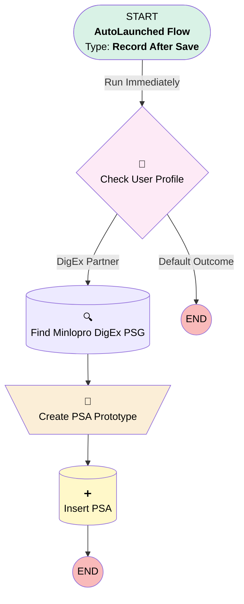

# Minlopro - User - After Create

## Flow Diagram

<!-- Flow description -->

## General Information

|<!-- -->|<!-- -->|
|:---|:---|
|Object|User|
|Process Type| Auto Launched Flow|
|Trigger Type| Record After Save|
|Record Trigger Type| Create|
|Label|Minlopro - User - After Create|
|Status|Active|
|Description|RTF for User object that handles AFTER INSERT phase along with Async path.|
|Environments|Default|
|Interview Label|Minlopro - User - After Create {!$Flow.CurrentDateTime}|
| Builder Type (PM)|LightningFlowBuilder|
| Canvas Mode (PM)|AUTO_LAYOUT_CANVAS|
| Origin Builder Type (PM)|LightningFlowBuilder|

#### Scheduled Paths

|Label|Name|Offset Number|Offset Unit|Record Field|Time Source|Connector|
|:-- |:-- |:-- |:-- |:-- |:-- |:--  |
|<!-- -->|<!-- -->|<!-- -->|<!-- -->|<!-- -->|<!-- -->|[Check_User_Profile](#check_user_profile)|

## Variables

|Name|Data Type|Is Collection|Is Input|Is Output|Object Type|Description|
|:-- |:--:|:--:|:--:|:--:|:--:|:--  |
|digExUserPsa|SObject|⬜|⬜|⬜|PermissionSetAssignment|Permission Set Assignment record for newly created DigEx user.|

## Flow Nodes Details

### Create_PSA_Prototype

|<!-- -->|<!-- -->|
|:---|:---|
|Type|Assignment|
|Label|Create PSA Prototype|
|Connector|[Insert_PSA](#insert_psa)|

#### Assignments

|Assign To Reference|Operator|Value|
|:-- |:--:|:--: |
|digExUserPsa.AssigneeId| Assign|$Record.Id|
|digExUserPsa.PermissionSetGroupId| Assign|Find_Minlopro_DigEx_PSG.Id|

### Check_User_Profile

|<!-- -->|<!-- -->|
|:---|:---|
|Type|Decision|
|Label|Check User Profile|
|Default Connector Label|Default Outcome|

#### Rule DigEx_Partner (DigEx Partner)

|<!-- -->|<!-- -->|
|:---|:---|
|Connector|[Find_Minlopro_DigEx_PSG](#find_minlopro_digex_psg)|
|Condition Logic|and|

|Condition Id|Left Value Reference|Operator|Right Value|
|:-- |:-- |:--:|:--: |
|1|$Record.Profile.Name| Equal To|DigEx Partner|

### Insert_PSA

|<!-- -->|<!-- -->|
|:---|:---|
|Type|Record Create|
|Label|Insert PSA|
|Input Reference|digExUserPsa|

### Find_Minlopro_DigEx_PSG

|<!-- -->|<!-- -->|
|:---|:---|
|Type|Record Lookup|
|Object|PermissionSetGroup|
|Label|Find Minlopro DigEx PSG|
|Assign Null Values If No Records Found|⬜|
|Get First Record Only|✅|
|Store Output Automatically|✅|
|Connector|[Create_PSA_Prototype](#create_psa_prototype)|

#### Filters (logic: **and**)

|Filter Id|Field|Operator|Value|
|:-- |:-- |:--:|:--: |
|1|DeveloperName| Equal To|Minlopro_PSG_DigExUser|

___

_Documentation generated from branch develop by [sfdx-hardis](https://sfdx-hardis.cloudity.com), featuring [salesforce-flow-visualiser](https://github.com/toddhalfpenny/salesforce-flow-visualiser)_