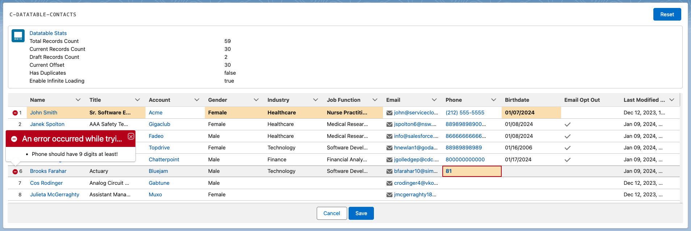
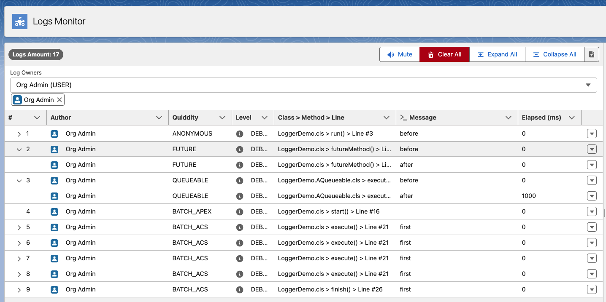

# Core / Base Modules

## Re-usable Lightning Web Components

-   `bridge.js` - used for communication between components (based off of LMS)
-   `c-combobox` - custom LWC that extends base `lightning-combobox` LWC
-   `c-datatable` - extension of base `lightning-datatable` LWC that supports editable lookups & picklists
-   `c-stencil-skeleton` - UI LWC that improves UX while component is loading
-   `toastify.js` - utility module that facades API around toast notifications
-   `utilities.js` - boilerplate JS functions

[Check out `c-datatable` with Custom Data Types](https://youtu.be/DvqtHMrvp8k)

Features:

-   CDT for _Lookup_
-   CDT for _Picklist (Single/Multi)_
-   CDT for _Dependent Picklist (Single/Multi)_
-   CDT for _Custom Combobox (with icons & 'fixed' mode)_

## FFLib

Open-source framework for Salesforce development.

Sources:

-   https://github.com/apex-enterprise-patterns/fflib-apex-common
-   https://github.com/apex-enterprise-patterns/fflib-apex-mocks

## Logger

Exposes custom means for Apex logs tracking/monitoring.
Originally inspired by https://github.com/rsoesemann/apex-unified-logging.

**How To Use**

1. Assign `Minlopro_Logger.permissionset` to the running user.
2. Configure `LogsMonitor.tab` visibility for the running user and navigate to it.
3. Create `LoggerSettings__c` custom setting record in the org with `LogsEmissionDate__c` field equal to `TODAY`.
4. Invoke `new LoggerDemo().run();` in ANONYMOUS Apex and observe the results!
