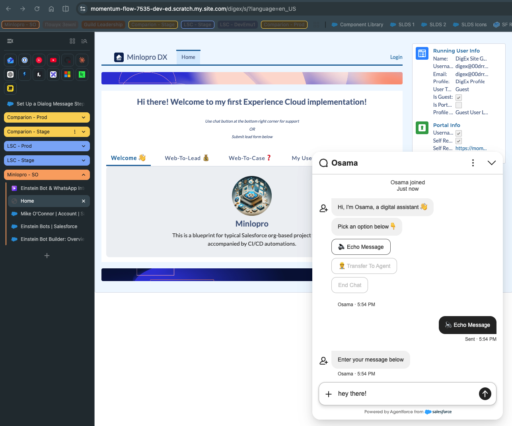

# Salesforce Einstein Bot

[Einstein Bot](https://help.salesforce.com/s/articleView?id=service.bot_intro.htm) is Salesforce's native chatbot
platform for Digital Experience (Community) sites, built on a **rule-based, dialog-tree architecture**: conversations
are modeled as a graph of Dialogs and Steps, transitions between them are driven by predefined intent detection,
structured user input (menus, quick replies), and configurable conditions, and each Step invokes deterministic actions
(Flows, Apex, standard actions) to fetch or update Salesforce data.

Typical use cases this resolves:

- Deflection of routine service requests
- Guided self-service
- Qualification and routing
- Data-backed answers

**Important: this has nothing in common with LLMs.** Einstein Bot does not generate free-form natural-language
responses, does not use a large language model, and has no generative or open-ended reasoning capability. Every branch
of the conversation is explicitly authored (dialogs, intents, conditions, actions) in Bot Builder — there's no model
producing novel text at runtime. This makes behavior fully deterministic and predictable, but also means the bot can
only handle conversation paths that were explicitly designed in advance, unlike LLM-based/generative agents (e.g.,
Agentforce) that can reason over open-ended input.

Preview:

