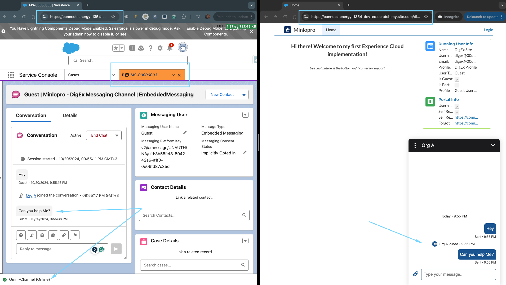
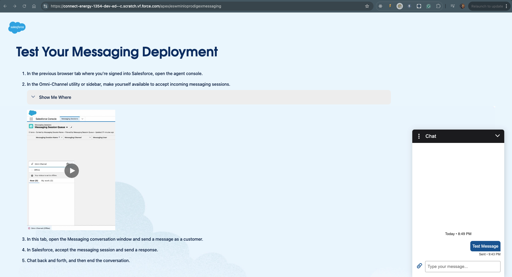

## Messaging for In-App and Web for Digital Experience Sites

Originally inspired by the following articles:

- https://medium.com/@rjallu01/salesforce-how-to-setup-messaging-for-in-app-and-web-user-verification-for-communities-eb77ebd96b85
- https://medium.com/@rjallu01/salesforce-messaging-miaw-how-to-setup-pre-chat-form-for-communities-6886ec58d7c9

Functionality Preview:

### Post-Deployment Manual Steps

1. Activate `Minlopro - DigEx Messaging Channel` messaging channel (see `Setup > Messaging Settings`)
2. Publish `Minlopro - DigEx Messaging` ESD (see `Setup > Embedded Service Deployments`)
3. Grant access to _Service Presence Statuses_ via permission set

### CI/CD Considerations

The following files leverage SFDX Replacements in scope of deployments:

- Site > [ESW_Minlopro_DigExMessaging Site](src/minlopro-digex-messaging/main/sites/ESW_Minlopro_DigExMessaging.site-meta.xml)
- Site Page > [DigEx Home Page](src/minlopro-digex/main/experiences/DigEx1/views/home.json)
- Omni-Channel Flow > [DigEx - Route Messaging Requests](src/minlopro-digex-messaging/main/flows/DigEx_RouteMessagingRequests.flow-meta.xml)

### Troubleshooting

The creation of Experience Site for 'Messaging for In-App and Web' also entails generation of `eswminloprodigexmessaging` Visualforce Page.
Leverage this page to resolve configuration issues or verify messaging functionality. Please note that this VF page is excluded from source intentionally.

Page URL = `https://[org_domain]--c[.scratch].vf.force.com/apex/eswminloprodigexmessaging`.

