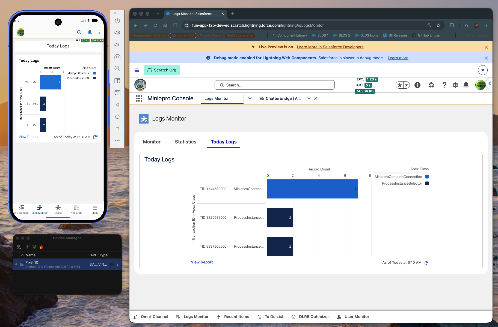

# 📱 Salesforce Mobile Experience Summary

## 🔎 Overview

Salesforce delivers its mobile experience primarily through the dedicated [Salesforce Mobile App](https://help.salesforce.com/s/articleView?id=xcloud.salesforce_app.htm&type=5),
giving users access to Salesforce data, standard and custom objects, workflows, push notifications,
and custom functionality on supported iOS and Android devices. On supported iPad devices, users can
also reach Salesforce through Lightning Experience in Safari.

> ⚠️ **Obsolete: Mobile Web Browser Access**
> Accessing a Salesforce org via a standard mobile web browser is an obsolete, retired approach.
> As detailed in Salesforce Help article [000380219](https://help.salesforce.com/s/articleView?id=000380219&type=1),
> Salesforce retired the legacy mobile browser experience starting with the **Summer '20 release**.
> Users must install the official app from the [Apple App Store](https://apps.apple.com/us/app/salesforce/id404249815)
> or [Google Play Store](https://play.google.com/store/apps/details?id=com.salesforce.chatter&hl=en_IE), or use Safari
> on supported iPads.

---

## 🛠️ Options for Debugging the Salesforce Mobile Experience

### 1️⃣ Virtual Device with the Salesforce App

Run the Salesforce mobile app on a virtual Android or iOS device using Android Studio or Xcode
emulators/simulators. Setup follows the official Salesforce [Mobile Previews guide](https://developer.salesforce.com/docs/platform/mobile-offline/guide/dx-mobile-previews-salesforce-app.html),
with a walkthrough available in this [video guide](https://www.youtube.com/watch?v=3Kd5JMQBgI8).

**Preview:**

### 2️⃣ BYOD — Bring Your Own Device

Test the Salesforce mobile experience directly on a physical personal or approved mobile device.
This approach leverages authentication and passkey configurations already present on the device.
macOS and iOS users can also use iPhone Mirroring to interact with and display the mobile screen
directly on their computer ([video reference](https://www.youtube.com/watch?v=f3REBdDPd58)).
