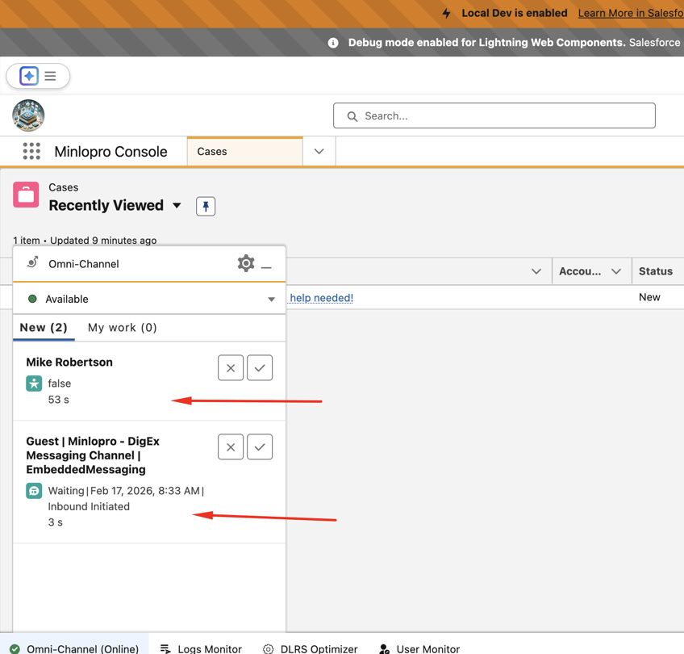

## Salesforce Omni-Channel Architecture

Omni-Channel is Salesforce's intelligent work routing engine. It intercepts newly assigned records sitting in queues and pushes them in real time to available agents, based on capacity and routing rules.

The core principle: **Omni-Channel does not create or assign records — it routes them.** Your existing queues and assignment rules handle ownership; Omni-Channel handles _delivery_ to the right agent at the right time.

---

### Routing Flow

```
Record Created / Updated
        ↓
Assignment Rule
        ↓
Queue (holds the work item)
        ↓
Service Channel (watches the object)
        ↓
Routing Configuration (how to route it; tags work item with capacity score/weight)
        ↓
Presence Configuration (who can receive it; accounts for total capacity defined)
        ↓
Agent's Omni-Channel Widget
```

---

### Demo

Omni-channel setup that handles work items of different sobject types (Leads, In-App Messaging, Cases etc.):


