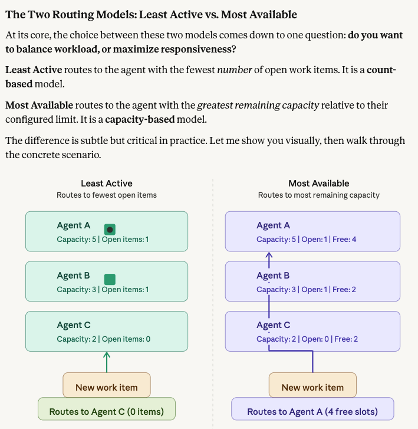
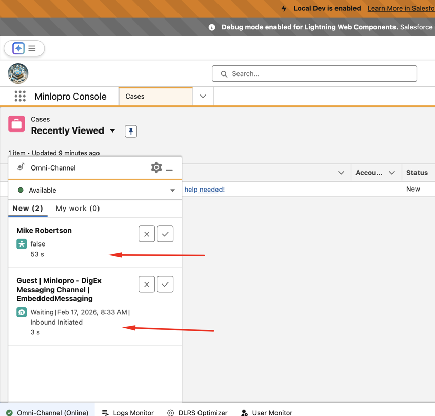
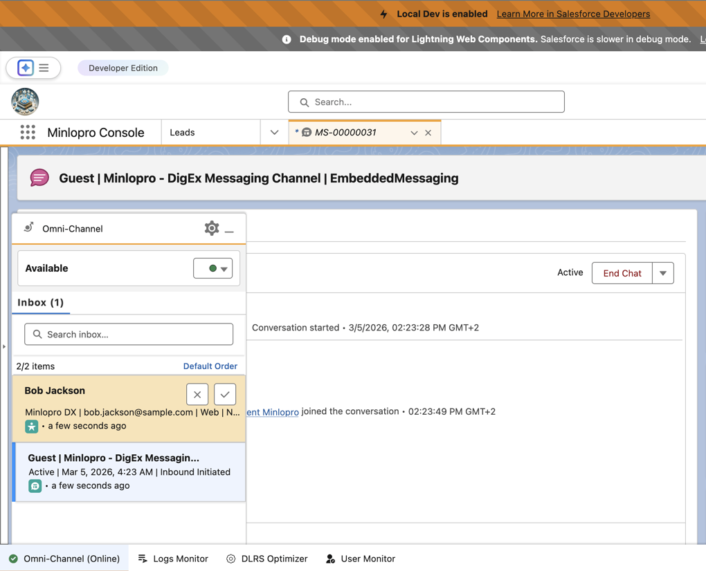
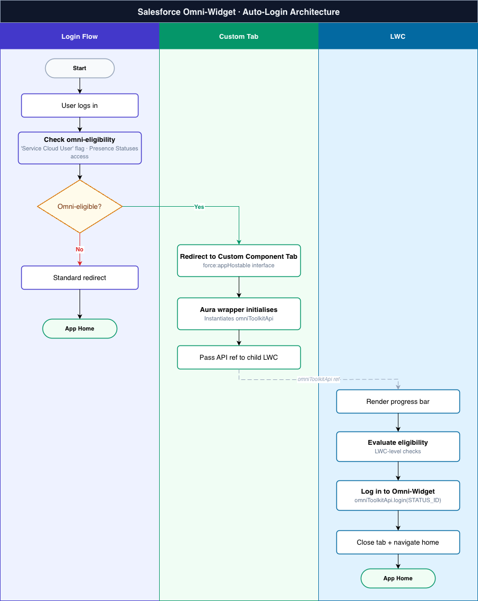

## Salesforce Omni-Channel Architecture

Omni-Channel is Salesforce's intelligent work routing engine. It intercepts newly assigned records sitting in queues and
pushes them in real time to available agents, based on capacity and routing rules.

The core principle: **Omni-Channel does not create or assign records — it routes them.** Your existing queues and
assignment rules handle ownership; Omni-Channel handles _delivery_ to the right agent at the right time.

---

### Routing Flow

```
Record Created / Updated
        ↓
Assignment Rule
        ↓
Queue (holds the work item)
        ↓
Service Channel (watches the object)
        ↓
Routing Configuration (how to route it; tags work item with capacity score/weight)
        ↓
Presence Configuration (who can receive it; accounts for total capacity defined)
        ↓
Agent's Omni-Channel Widget
```

---

### Key Considerations/Limitations To Know

Routing & Priority

- **Priority is intra-queue only.** Routing priority determines which work item gets pushed to an agent first within a
  queue — it does not move items across queues. Cross-queue overflow requires explicit automation.
- **Routing Configuration is 1-to-1 with queues.** One queue, one Routing Configuration — no sharing across queues.

Routing Models Explanation



Service Channels

- **One Service Channel per object, hard limit.**
- You cannot create multiple Service Channels for the same standard or custom object — this is a platform constraint
  with no workaround.

Presence Configuration

- **Profiles/Users only — no groups or roles.** Presence Configuration membership must be maintained per individual
  user, which
  might create manual overhead during onboarding/offboarding.
- **One Presence Configuration per user, silently enforced.** Adding a user to a second Presence Configuration
  automatically removes them from their existing one — no warning shown.

Key Standard Objects

- **`UserServicePresence` is a historical log.** Each record represents a status interval. Use the `IsCurrentState` flag
  to identify an agent's current active status.
- **`PendingServiceRouting` is created by the Automated Process user.** The object doesn’t invoke triggers before or
  after insert, or any action (trigger, workflow rule, validation) that could interfere with the creation of the record.
- **`AgentWork` requires object-level access.** The receiving user must have read access to the routed object (Lead,
  Case, etc.) or the routing engine will skip them silently.

User Setup

- **`Service Cloud User` license flag must be enabled.** Without it, the Omni Supervisor tab shows no queues assigned to
  the user — even if all other configuration is correct.

---

### Skill-Based Routing

https://medium.com/@shirley_peng/salesforce-omni-channel-how-skills-based-routing-really-works-54326fafbdc8

---

### Demo

Omni-channel setup that handles work items of different sobject types (Leads, In-App Messaging, Cases etc.):

| Standard Omni-Channel Widget                                                                               | Enhanced Omni-Channel Widget                                                                               |
| ---------------------------------------------------------------------------------------------------------- | ---------------------------------------------------------------------------------------------------------- |
|  |  |

---

### Auto-Login into Omni-Widget


